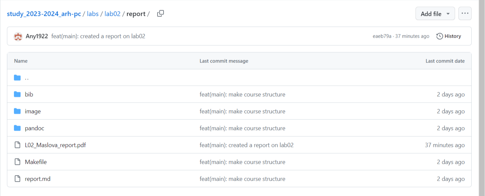

---
## Front matter
title: "Отчёт по лабораторной работе №2"
author: "Маслова Анна Павловна"

## Generic otions
lang: ru-RU
toc-title: "Содержание"

## Bibliography
bibliography: bib/cite.bib
csl: pandoc/csl/gost-r-7-0-5-2008-numeric.csl

## Pdf output format
toc: true # Table of contents
toc-depth: 2
lof: true # List of figures
lot: true # List of tables
fontsize: 12pt
linestretch: 1.5
papersize: a4
documentclass: scrreprt
## I18n polyglossia
polyglossia-lang:
  name: russian
  options:
	- spelling=modern
	- babelshorthands=true
polyglossia-otherlangs:
  name: english
## I18n babel
babel-lang: russian
babel-otherlangs: english
## Fonts
mainfont: PT Serif
romanfont: PT Serif
sansfont: PT Sans
monofont: PT Mono
mainfontoptions: Ligatures=TeX
romanfontoptions: Ligatures=TeX
sansfontoptions: Ligatures=TeX,Scale=MatchLowercase
monofontoptions: Scale=MatchLowercase,Scale=0.9
## Biblatex
biblatex: true
biblio-style: "gost-numeric"
biblatexoptions:
  - parentracker=true
  - backend=biber
  - hyperref=auto
  - language=auto
  - autolang=other*
  - citestyle=gost-numeric
## Pandoc-crossref LaTeX customization
figureTitle: "Рис."
tableTitle: "Таблица"
listingTitle: "Листинг"
lofTitle: "Список иллюстраций"
lotTitle: "Список таблиц"
lolTitle: "Листинги"
## Misc options
indent: true
header-includes:
  - \usepackage{indentfirst}
  - \usepackage{float} # keep figures where there are in the text
  - \floatplacement{figure}{H} # keep figures where there are in the text
---

# Цель работы

Изучение идеологии и применения средств контроля версий. Приобретение
практических навыков по работе с системой git.

# Выполнение лабораторной работы

В самом начале создаём учётную запись на сайте https://github.com/ и
заполняем все основные данные.
Далее делаем предварительную конфигурацию git. Открыв терминал, вводим
команды, показанные на рис.1, указав свои имя и e-mail.

{#fig:001 width=70%}

Настраиваем utf-8 в выводе сообщений git и задаём имя начальной ветки
(master) (рис.2).

{#fig:002 width=70%}

Задаём параметры autocrlf и safecrlf (рис.3).

{#fig:003 width=70%}

Приступаем к созданию SSH ключа. Сгенерируем пару ключей для
идентификации пользователя на сервере репозиториев (рис.4,5).

{#fig:004 width=70%}

{#fig:005 width=70%}

Далее загружаем сгенерированный открытый ключ на https://github.com/. С
помощью команды cat выводим на экран этот ключ и копируем его в буфер обмена
(рис.6).

{#fig:006 width=70%}

На экране появился созданный ключ. Скопировав его, вставляем в
специальное поле, указав для него имя Title, после чего на экране видим: (рис.7)

{#fig:007 width=70%}

Это свидетельствует о том, что ключ успешно загружен.
Для дальнейшего выполнения лабораторных работ требуется определённое
рабочее пространство. Для этого создадим каталог для предмета «Архитектура
компьютера» и проверим, что он появился в домашнем каталоге (рис.8).

{#fig:008 width=70%}

Как мы видим, каталог появился.
Далее создадим репозиторий курса на основе шаблона. Переходим по
нужной ссылке и нажимаем кнопку “Использовать этот шаблон”, задаём имя для
репозитория study_2023-2024_arh-pc и создаём его (рис.9).

{#fig:009 width=70%}

Репозиторий создан. Теперь необходимо клонировать его на компьютер.
Переходим в созданный ранее каталог курса и клонируем репозиторий в него,
скопировав перед этим ссылку для клонирования на github (рис.10).

{#fig:010 width=70%}

Перейдём в каталог курса, где удалим лишние файлы (package.json) и
создадим необходимые каталоги (рис.11).

{#fig:011 width=70%}

После проверки видим, что в каталоге находятся нужные элементы.
Отправим файлы на сервер (рис. 12, 13).

{#fig:012 width=70%}

{#fig:013 width=70%}

Все изменения локального дерева сохранены и отправлены в центральный
репозиторий.
Проверим правильность создания иерархии рабочего пространства в
локальном репозитории и на странице github (рис. 14, 15).

{#fig:014 width=70%}

{#fig:015 width=70%}

Все нужные файлы и каталоги находятся в нашем репозитории, а файл
package.jso удалён.

# Выполнение заданий для лабораторной работы

**Задание №1:** Создание отчета по выполнению лабораторной работы в
соответствующем каталоге рабочего пространства (labs>lab02>report).

Сначала загрузим файл с отчётом по выполнению лабораторной работы №2 в
домашнюю директорию (рис.16).

{#fig:016 width=70%}

Убедились в том, что файл «L02_Maslova_report.pdf» есть в домашнем
каталоге.
Затем перейдём в рабочее пространство, а именно в папку «Lab02» в
локальном репозитории. С помощью команды cp копируем файл с отчётом в
каталог report (рис.17).

{#fig:017 width=70%}

После проверки, убедились, что файл на месте.

**Задание №2:** Скопировать от чёты по выполнению предыдущих лабораторных работ в соответствующие каталоги репозитория.

Загрузим файл с отчётом по выполнению лабораторной работы №1 в
домашнюю директорию (рис.18).

{#fig:018 width=70%}

Видим, что файл «L01_Maslova_report.pdf» теперь здесь присутствует.
Далее перейдём в рабочее пространство, в папку «Lab01» в локальном
репозитории. С помощью команды cp копируем файл с отчётом в каталог report
(рис.19).

{#fig:019 width=70%}

Убедились с помощью команды ls, что файл находится в рабочем
пространстве.

**Задание №3:** Загрузка файлов на github.

Далее нам нужно внести все изменения в центральный репозиторий. С
помощью команды “git add .” добавляем созданный файл с ЛР№2 в локальное
дерево. Команда “git commit –am” сохранит коммит вместе с его описанием. Затем
командой “git push” отправляем все изменения в центральный репозиторий (рис.20).

{#fig:020 width=70%}

Проверим наличие файла на странице в github (рис.21).

{#fig:021 width=70%}

Отчёт по выполнению лабораторной работы №2 успешно загружен на github.
Всё то же самое делаем с отчётом по лабораторной работе №1 (рис.22):

{#fig:022 width=70%}

Произведём проверку (рис.23):

{#fig:023 width=70%}

# Выводы

Мы освоили применение средств контроля версий и познакомились с их
идеологией. Научились работать с системой git на практике.

# Список литературы{.unnumbered}

1.GDB:The GNU Project Debugger.—URL:2016.—URL: https://www.gnu.org/software/gdb/.
2.GNU Bash—Manual.https://www.gnu.org/software/bash/manual/.
3. Midnight Commander Development Center. — 2021. — URL: https://midnight-
commander.
org/.
4. NASM Assembly Language Tutorials. — 2021. — URL: https://asmtutor.com/.
5. Newham C. Learning the bash Shell: Unix Shell Programming. — O’Reilly
Media, 2005. —354с.—(In a Nutshell).—ISBN 0596009658.—URL:http://www.amazon.com/Learningbash-Shell-Programming-Nutshell/dp/0596009658.
6. Robbins A. Bash Pocket Reference. — O’Reilly Media, 2016. — 156 с. —
ISBN 978-1491941591.
7. The NASM documentation. — 2021. — URL: https://www.nasm.us/docs.php.
8. Zarrelli G. Mastering Bash. — Packt Publishing, 2017. — 502 с. — ISBN
9781784396879.
9. Колдаев В. Д., Лупин С. А. Архитектура ЭВМ. — М. : Форум, 2018.
10. Куляс О. Л., Никитин К. А. Курс программирования на ASSEMBLER. —
М. : Солон-Пресс, 2017.
