---
## Front matter
title: "Отчёт по лабораторной работе №4"
subtitle: "дисциплина: Архитектра компьютера"
author: "Маслова Анна Павловна"

## Generic otions
lang: ru-RU
toc-title: "Содержание"

## Bibliography
bibliography: bib/cite.bib
csl: pandoc/csl/gost-r-7-0-5-2008-numeric.csl

## Pdf output format
toc: true # Table of contents
toc-depth: 2
lof: true # List of figures
lot: true # List of tables
fontsize: 12pt
linestretch: 1.5
papersize: a4
documentclass: scrreprt
## I18n polyglossia
polyglossia-lang:
  name: russian
  options:
	- spelling=modern
	- babelshorthands=true
polyglossia-otherlangs:
  name: english
## I18n babel
babel-lang: russian
babel-otherlangs: english
## Fonts
mainfont: PT Serif
romanfont: PT Serif
sansfont: PT Sans
monofont: PT Mono
mainfontoptions: Ligatures=TeX
romanfontoptions: Ligatures=TeX
sansfontoptions: Ligatures=TeX,Scale=MatchLowercase
monofontoptions: Scale=MatchLowercase,Scale=0.9
## Biblatex
biblatex: true
biblio-style: "gost-numeric"
biblatexoptions:
  - parentracker=true
  - backend=biber
  - hyperref=auto
  - language=auto
  - autolang=other*
  - citestyle=gost-numeric
## Pandoc-crossref LaTeX customization
figureTitle: "Рис."
tableTitle: "Таблица"
listingTitle: "Листинг"
lofTitle: "Список иллюстраций"
lotTitle: "Список таблиц"
lolTitle: "Листинги"
## Misc options
indent: true
header-includes:
  - \usepackage{indentfirst}
  - \usepackage{float} # keep figures where there are in the text
  - \floatplacement{figure}{H} # keep figures where there are in the text
---

# Цель работы

Освоение процедуры компиляции и сборки программ, написанных на ассемблере NASM.

# Выполнение лабораторной работы

Для начала создаём специальный каталог для работы с программами на языке ассемблера NASM и сразу перейдём в этот каталог (рис.2.1).

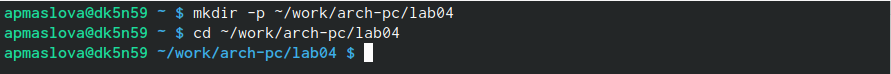{#fig:001 width=70%}

Далее создадим в этом каталоге текстовый файл с именем hello.asm и откроем его в редакторе gedit (рис.2.2).

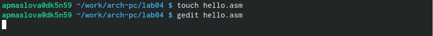{#fig:002 width=70%}

В gedit в этот файл введём текст программы для вывода на экран 'Hello world!' (рис.2.3).

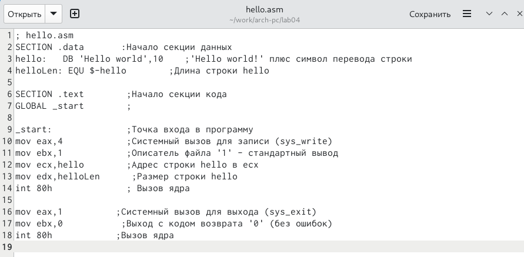{#fig:003 width=70%}

Затем необходимо скомпилировать написанный код. Для этого воспользуемся следующей командой в консоли: (рис.2.4)

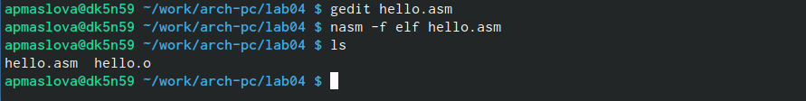{#fig:004 width=70%}

После проверки убедились, что в каталоге есть файл с текстом программы с расширением .asm и файл с объектным кодом с расширением .o (убедились, что они имеют одинаковые названия - hello).

Далее созданим объектный файл obj.o (рис.2.5)

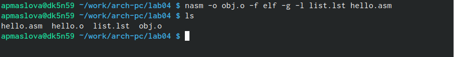{#fig:005 width=70%}

После проверки убедились, что файл создан.

Этот файл необходимо скомпоновать. Передадим его компоновщику с помощью следующей команды и проверим наличие соответствующего файла: (рис.2.6)

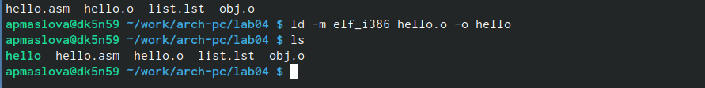{#fig:006 width=70%}

Видим, что файл hello создан.

И после этого создаём исполняемый файл из объектного файла obj.o и задаём ему имя main (рис.2.7).

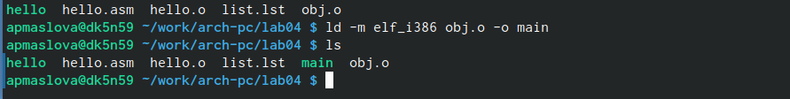{#fig:007 width=70%}

Проверили, увидели, что исполняемый файл main создан.

Запускаем исполняемый файл: (рис.2.8).

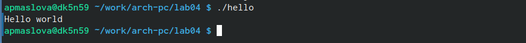{#fig:008 width=70%}

Увидели на экране фразу "Hello world!".

# Выполнение заданий для самостоятельно работы

Сначала в каталоге ~/work/arch-pc/lab04 создаём копию файла hello.asm с именем lab4.asm (рис.3.1).

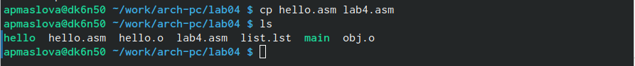{#fig:009 width=70%}

Далее в редакторе изменяем текст программы, чтобы на экран выводилась строка "Маслова Анна" (рис.3.2).

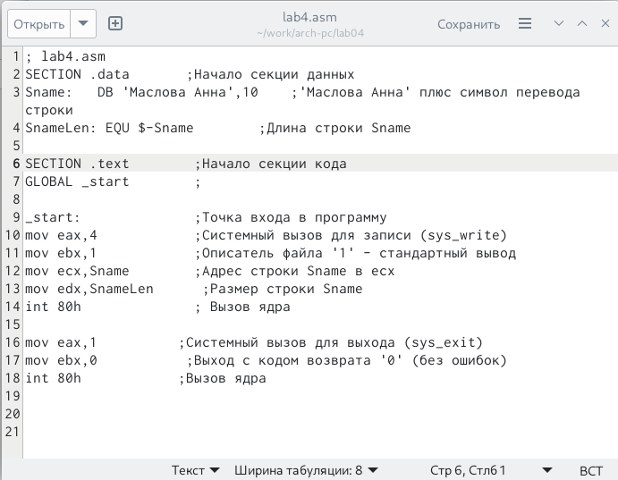{#fig:010 width=70%}

Сохранили изменения.

Затем преобразуем текст написанной программы в объектный код (рис.3.3).

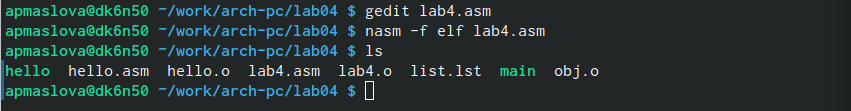{#fig:011 width=70%}

Проверили наличие соответствующего файла.

Создадим объектный файл с именем nobj.o (рис.2.4).

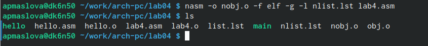{#fig:012 width=70%}

Как мы видим, объектный файл создан. 

Скомпонуем объектный файл (рис.3.5).

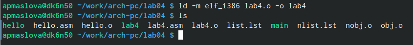{#fig:013 width=70%}

И создаём исполняемый файл с именем nmain (рис.3.6).

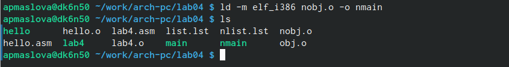{#fig:014 width=70%}

Как мы видим, файл создан.

Запускаем на выполнение созданный исполняемый файл (рис.3.7):

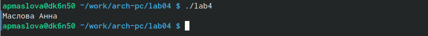{#fig:015 width=70%}

На экране видим искомую строку с фамилией и именем.

# Выводы

Мы освоили процедуры сборки программ, написанных на языке ассемблера NASM. Научились их компилировать.

# Список литературы{.unnumbered}

1. GDB: The GNU Project Debugger. — URL: https://www.gnu.org/software/gdb/.
2. GNU Bash Manual. — 2016. — URL: https://www.gnu.org/software/bash/manual/.
3. Midnight Commander Development Center. — 2021. — URL: https://midnight-commander.
org/.
4. NASM Assembly Language Tutorials. — 2021. — URL: https://asmtutor.com/.
5. Newham C. Learning the bash Shell: Unix Shell Programming. — O’Reilly Media, 2005. —
354 с. — (In a Nutshell). — ISBN 0596009658. — URL: http://www.amazon.com/Learning-
bash-Shell-Programming-Nutshell/dp/0596009658.
6. Robbins A. Bash Pocket Reference. — O’Reilly Media, 2016. — 156 с. — ISBN 978-1491941591.
7. The NASM documentation. — 2021. — URL: https://www.nasm.us/docs.php.
8. Zarrelli G. Mastering Bash. — Packt Publishing, 2017. — 502 с. — ISBN 9781784396879.
9. Колдаев В. Д., Лупин С. А. Архитектура ЭВМ. — М. : Форум, 2018.
10. Куляс О. Л., Никитин К. А. Курс программирования на ASSEMBLER. — М. : Солон-Пресс,
2017.
