---
## Front matter
title: "Отчёт по лабораторной работе №5"
subtitle: "дисциплина: Архитектура компьютеров"
author: "Маслова Анна Павловна"

## Generic otions
lang: ru-RU
toc-title: "Содержание"

## Bibliography
bibliography: bib/cite.bib
csl: pandoc/csl/gost-r-7-0-5-2008-numeric.csl

## Pdf output format
toc: true # Table of contents
toc-depth: 2
lof: true # List of figures
lot: true # List of tables
fontsize: 12pt
linestretch: 1.5
papersize: a4
documentclass: scrreprt
## I18n polyglossia
polyglossia-lang:
  name: russian
  options:
	- spelling=modern
	- babelshorthands=true
polyglossia-otherlangs:
  name: english
## I18n babel
babel-lang: russian
babel-otherlangs: english
## Fonts
mainfont: PT Serif
romanfont: PT Serif
sansfont: PT Sans
monofont: PT Mono
mainfontoptions: Ligatures=TeX
romanfontoptions: Ligatures=TeX
sansfontoptions: Ligatures=TeX,Scale=MatchLowercase
monofontoptions: Scale=MatchLowercase,Scale=0.9
## Biblatex
biblatex: true
biblio-style: "gost-numeric"
biblatexoptions:
  - parentracker=true
  - backend=biber
  - hyperref=auto
  - language=auto
  - autolang=other*
  - citestyle=gost-numeric
## Pandoc-crossref LaTeX customization
figureTitle: "Рис."
tableTitle: "Таблица"
listingTitle: "Листинг"
lofTitle: "Список иллюстраций"
lotTitle: "Список таблиц"
lolTitle: "Листинги"
## Misc options
indent: true
header-includes:
  - \usepackage{indentfirst}
  - \usepackage{float} # keep figures where there are in the text
  - \floatplacement{figure}{H} # keep figures where there are in the text
---

# Цель работы

Приобрести навыки работы в *Midnight Commander* на практике. Освоить инструкции языка ассемблера *mov* и *int*.

# Выполнение лабораторной работы

С помощью комады mc откроем *Midnight Commander* (рис. @fig:001).

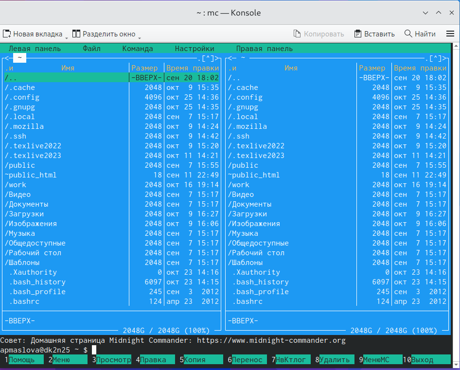{#fig:001 width=70%}

Затем с помощью клавиатуры переходим в каталог ~/work/arch-pc (рис. @fig:002).

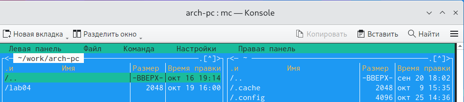{#fig:002 width=70%}

В этом каталоге с помощью клавиши F7 создадим папку *lab05* и перейдём в неё (рис. @fig:003).

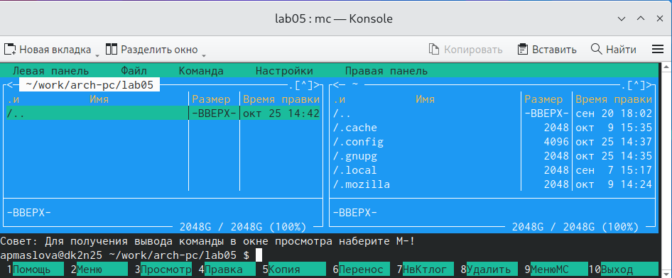{#fig:003 width=70%}

Далее ниже  строке ввода вводим команду *touch*, с помощью которой создадим файл *lab5-1.asm* (рис. @fig:004).

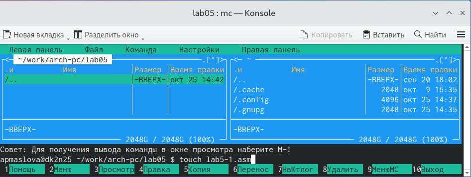{#fig:004 width=70%}

На рис. @fig:005 видим, что файл создан:

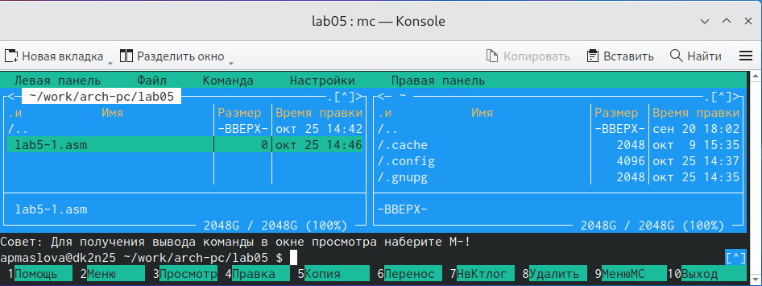{#fig:005 width=70%}

С помощью клавиши F4 откроем созданный файл для редактирования (рис. @fig:006).

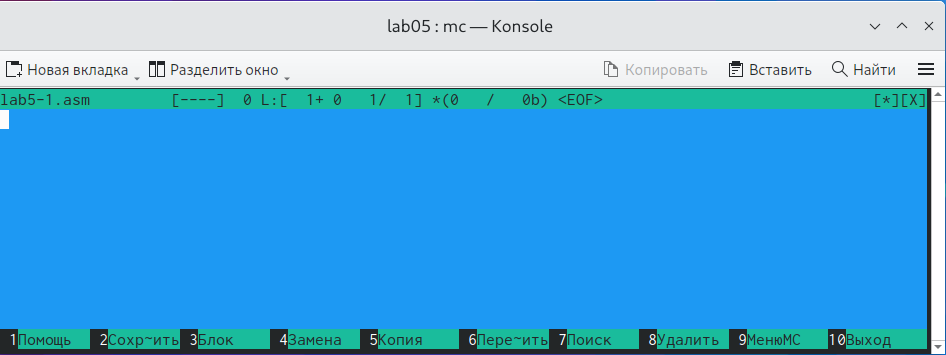{#fig:006 width=70%}

Видим, что открылся редактор mcedit. 

Введём текст программы вывода сообщения "Введите строку" на экран и ввода строки с клавиатуры (рис. @fig:024).

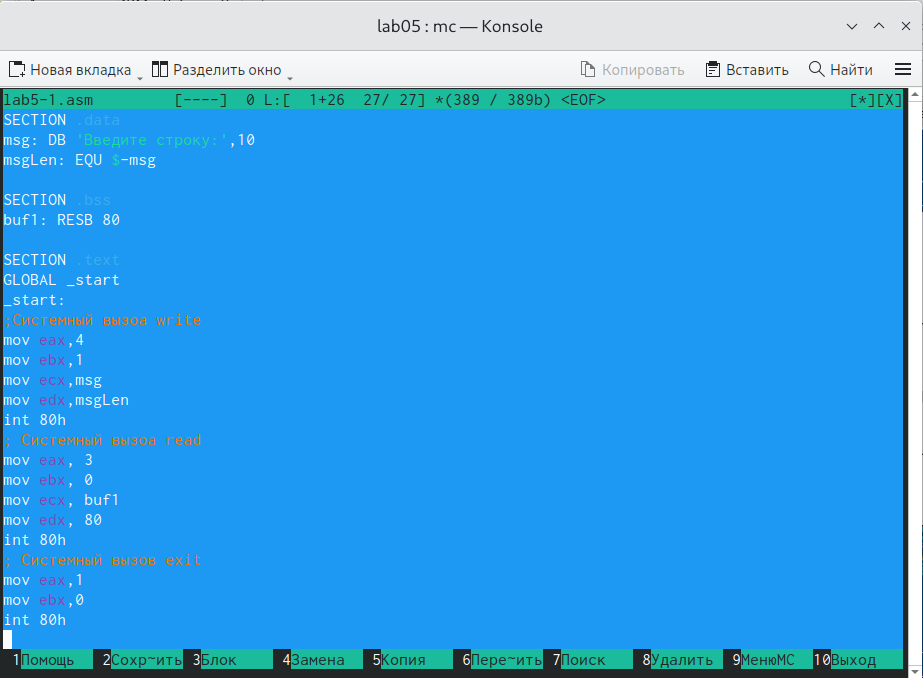{#fig:024 width=70%}

Сохранили изменения в файле с помощью функциональной клавиши F2 и закрыли mcedit, используя клавишу F10.

Нажмём клавишу F3, выделив файл *lab5-1.asm*, и проверим, что в нём содержится текст написанной программы (рис. @fig:007).

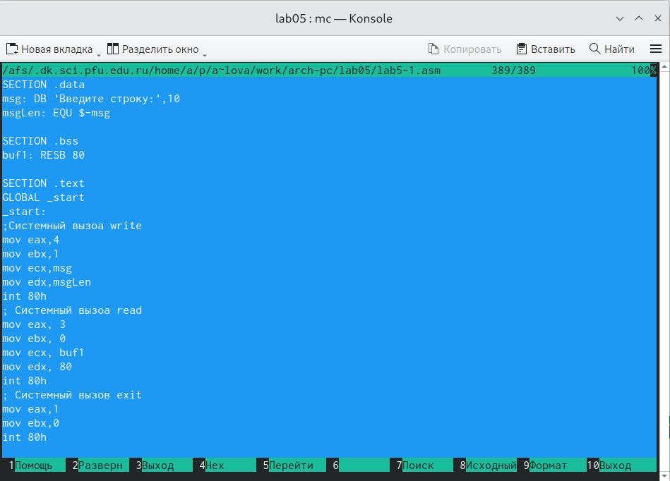{#fig:007 width=70%}

Теперь оттранслируем текст программы в объектный файл, а затем объектный файл скомпонуем и запустим получившийся исполняемый файл (рис. @fig:008).

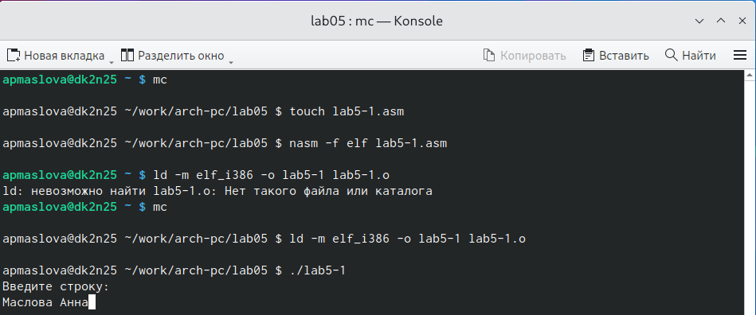{#fig:008 width=70%}

Как мы видим, программы работает: на экран выводится сообщение "Введите строку:" и считывается введённая строка (в нашем случае имя и фамилия - Маслова Анна).

Теперь создадим программу, выполняющую такую же функцию, но с помощью внешнего файла. Для этого с ТУИС скачиваем файл *in_out.asm* (рис. @fig:009).

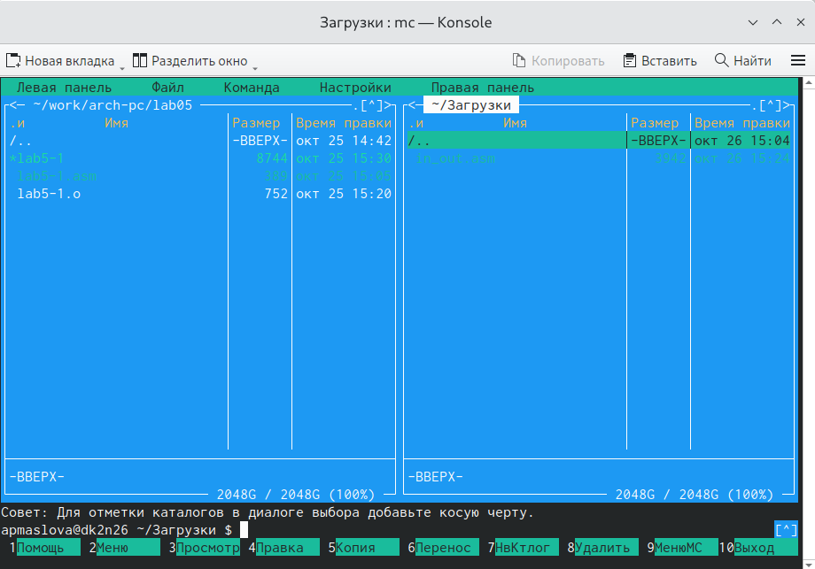{#fig:009 width=70%}

Загруженный файл *in_out.asm* помещён в каталог *Загрузки*. Чтобы применять его в программе *lab5-1.asm* он должен лежать в том же каталоге *~/work/arch-pc/lab05*. Скопируем этот файл в нужный каталог с помощью функциональной клавиши F5 (рис. @fig:010).

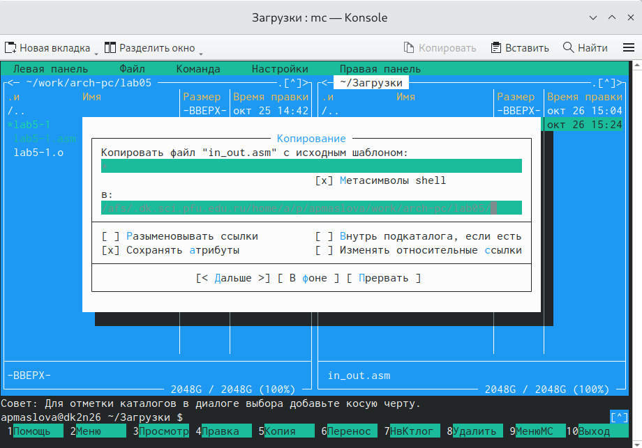{#fig:010 width=70%}

На рис. @fig:011 можем видеть, что файл *in_out.asm* содержится в каталоге *~/work/arch-pc/lab05*.

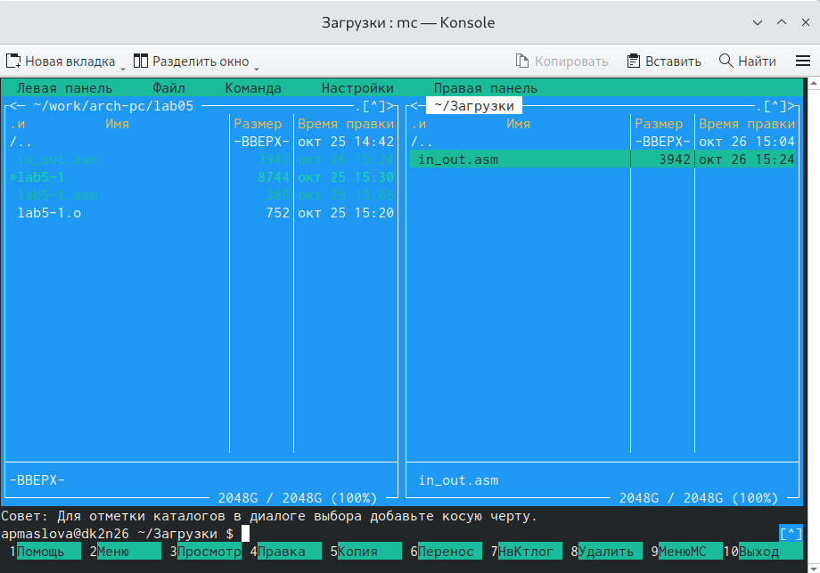{#fig:011 width=70%}

Далее нам нужно создать файл *lab5-2.asm*. Выделим файл *lab5-1.asm*. С помощью клавиши F6 мы можем переместить (то есть заменить) файл *lab5-1.asm* на файл *lab5-2.asm* (рис. @fig:012 , рис. @fig:013).

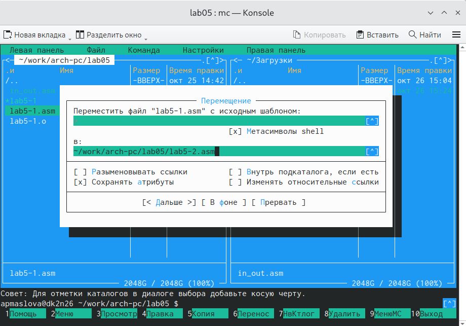{#fig:012 width=70%}

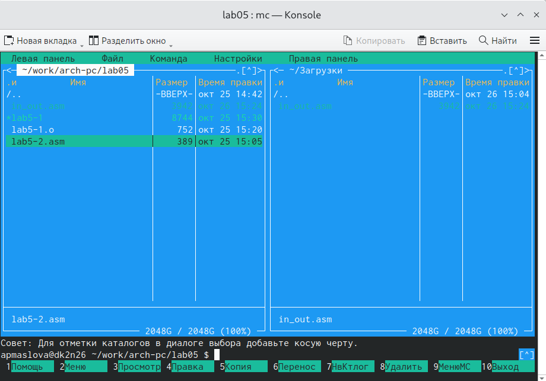{#fig:013 width=70%}

Однако файл *lab5-1.asm* нам пригодится в ходе выполнения дальнейших заданий лабораторной работы, поэтому вместо перемещения клавишей F6 файл *lab5-1.asm* мы скопируем в этот же каталог с помощью клавиши F5 и зададим ему имя "*lab5-2.asm*" (рис. @fig:025 , рис. @fig:026).

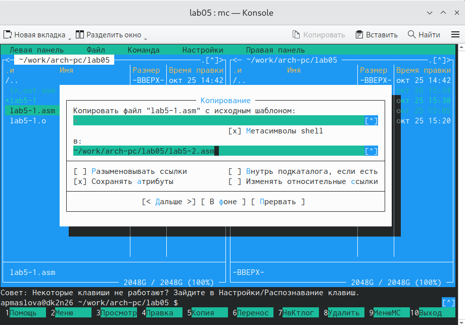{#fig:025 width=70%}

{#fig:026 width=70%}

Откроем созданный файл в редакторе и исправим текст программы в нём с использованием подпрограмм из загруженного внешнего файла *in_out.asm*, а именно - подпрограмм *sprintLF, sread, guit* (рис. @fig:014).

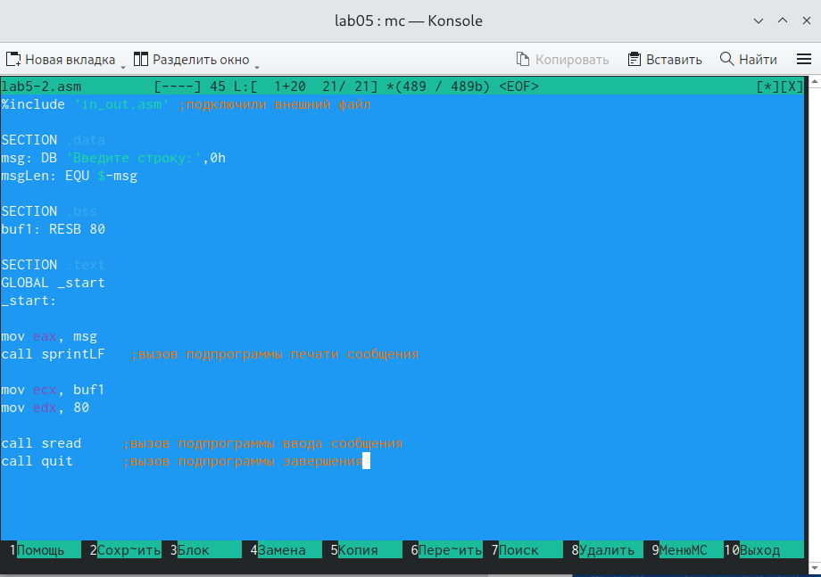{#fig:014 width=70%}

Создадим исполняемый файл и проверим его работу (рис. @fig:015).

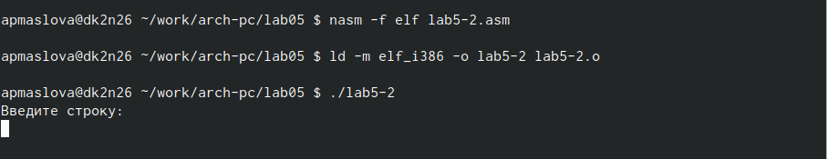{#fig:015 width=70%}

Как мы видим, программа выполняет свою функцию.

А теперь снова откроем в редакторе файл *lab5-2.asm* и заменим в нём подпрограмму *sprintLF* на *sprint* (рис. @fig:016).

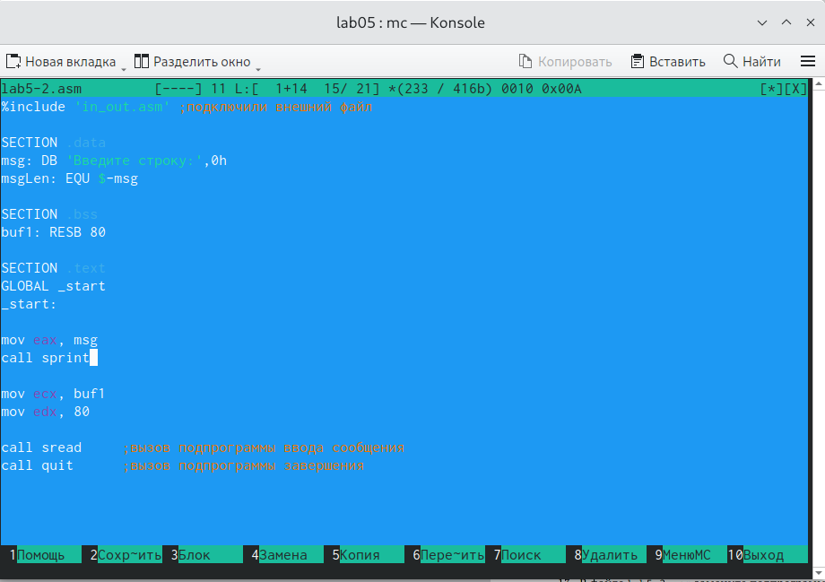{#fig:016 width=70%}

Создадим исполняемый файл и запустим его (рис. @fig:017).
 
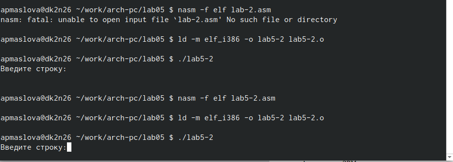{#fig:017 width=70%}

Файл запустился. Можно заметить, что подпрограмма *sprint* в отличие от  подпрограммы *sprintLF* не переносит строку. То есть в первом случае мы вводили нашу строку "Маслова Анна" на следующей строке после сообщения "Введите строку:", а во втором случае - в той же.

# Выполнение заданий для самостоятельной работы

Создадим копию файла *lab5-1.asm* и зададим имя новому файлу "*lab5-1c.asm*". Для этго используем клавишу F5 (рис. @fig:018).

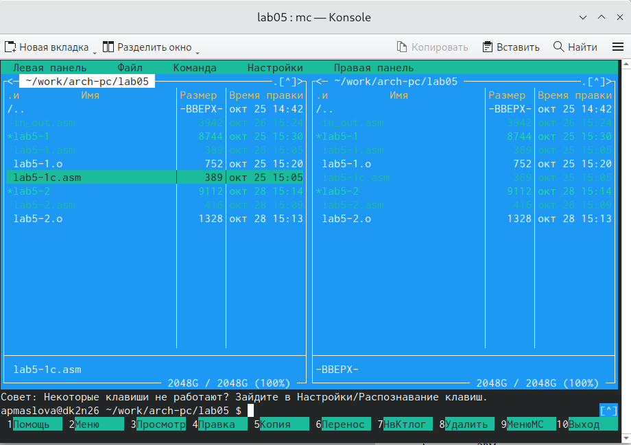{#fig:018 width=70%}

Файл создан. Откроем его в редакторе mcedit с помощью клавиши F4. 

Изменим текст программы, не используя при этом внешний файл *in_out.asm*. Нам нужно, чтобы теперь после ввода строки с клавиатуры, программа выводила введённую строку на экран. Для этого используем системный вызов *write* (в регистр *ecx* поместим значение переменной, куда записали введённую строку), как указано в листинге 3.1 и на рис. @fig:019 .

**Листинг 3.1. Программа вывода сообщения "Введите строку:" на экран, ввода строки с клавиатуры и вывода введённой строки на экран**

```
SECTION .data
msg: DB 'Введите строку:',10
msgLen: EQU $-msg

SECTION .bss
buf1: RESB 80

SECTION .text
GLOBAL _start
_start:

;Системный вызоа write

mov eax,4
mov ebx,1
mov ecx,msg
mov edx,msgLen
int 80h

; Системный вызоа read

mov eax, 3
mov ebx, 0
mov ecx, buf1
mov edx, 80
int 80h

;Сиcтемный вызов write

mov eax,4
mov ebx,1
mov ecx,buf1
mov edx,80
int 80h

; Системный вызов exit

mov eax,1
mov ebx,0
int 80h
```

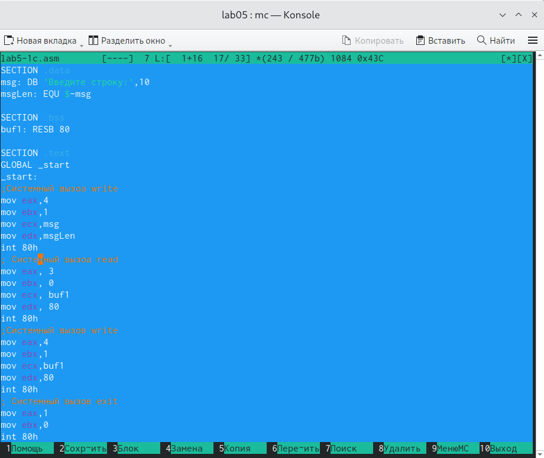{#fig:019 width=70%}

Создадим исполняемый файл и проверим его работу (рис. @fig:020).

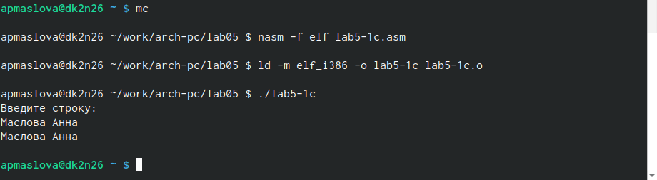{#fig:020 width=70%}

Как мы видим, программа работает корректно: на экран выводится сообщение "Введите строку:", мы вводим строку, и эта строка затем выводится на экран.

Теперь создадим копию файла *lab5-2.asm* и зададим имя новому файлу "*lab5-2c.asm*". Для этго используем клавишу F5 (рис. @fig:021).

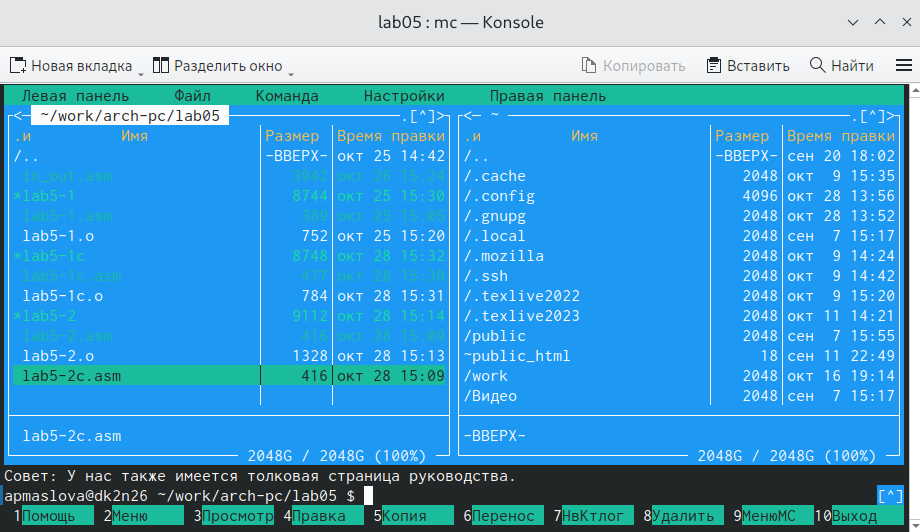{#fig:021 width=70%}

Файл создан. Откроем его в редакторе mcedit с помощью клавиши F4. 

Изменим текст программы,используя внешний файл *in_out.asm*. Нам нужно, чтобы программа работала так же, как *lab5-1c*. Для этого используем подпрограмму печати сообщения *sprintLF* (в регистр *ecx* поместим значение переменной, куда записали введённую строку), как указано в листинге 3.2 и на рис. @fig:022 .

**Листинг 3.2. Программа вывода сообщения "Введите строку:" на экран, ввода строки с клавиатуры и вывода введённой строки на экран с использованием внешнего файла in_out.asm**

```
%include 'in_out.asm' ;подключили внешний файл

SECTION .data
msg: DB 'Введите строку:',0h
msgLen: EQU $-msg

SECTION .bss
buf1: RESB 80

SECTION .text
GLOBAL _start
_start:

mov eax, msg
call sprint  ;вызов подпрограммы печати сообщения

mov ecx, buf1
mov edx, 80
call sread     ;вызов подпрограммы ввода сообщения

mov eax, buf1
call sprintLF   ;вызов подпрограммы печати сообщения

call quit      ;вызов подпрограммы завершения
```

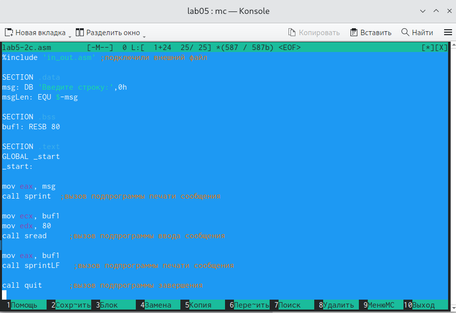{#fig:022 width=70%}

Создадим исполняемый файл и проверим его работу (рис. @fig:023).

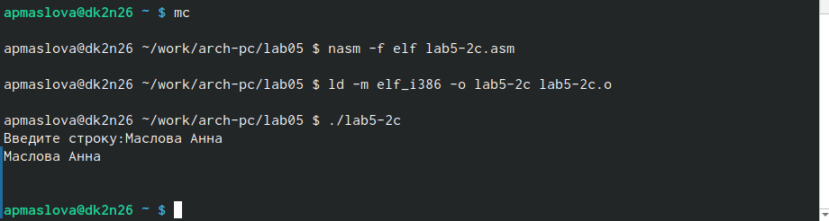{#fig:023 width=70%}

Как мы видим, программа работает корректно.

# Выводы

Мы научились работать в *Midnight Commander* на практике. Освоили инструкции языка ассемблера *mov* и *int*.

# Список литературы{.unnumbered}

1. GDB: The GNU Project Debugger. — URL: https://www.gnu.org/software/gdb/.
2. GNU Bash Manual. — 2016. — URL: https://www.gnu.org/software/bash/manual/.
3. Midnight Commander Development Center. — 2021. — URL: https://midnight-commander.
org/.
4. NASM Assembly Language Tutorials. — 2021. — URL: https://asmtutor.com/.
5. Newham C. Learning the bash Shell: Unix Shell Programming. — O’Reilly Media, 2005. —
354 с. — (In a Nutshell). — ISBN 0596009658. — URL: http://www.amazon.com/Learning-
bash-Shell-Programming-Nutshell/dp/0596009658.
6. Robbins A. Bash Pocket Reference. — O’Reilly Media, 2016. — 156 с. — ISBN 978-1491941591.
7. The NASM documentation. — 2021. — URL: https://www.nasm.us/docs.php.
8. Zarrelli G. Mastering Bash. — Packt Publishing, 2017. — 502 с. — ISBN 9781784396879.
9. Колдаев В. Д., Лупин С. А. Архитектура ЭВМ. — М. : Форум, 2018.
10. Куляс О. Л., Никитин К. А. Курс программирования на ASSEMBLER. — М. : Солон-Пресс,
2017.

