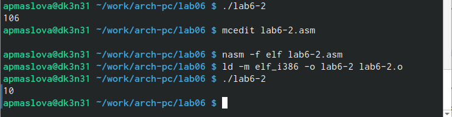
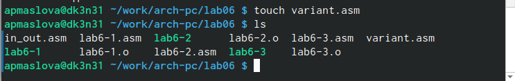

---
## Front matter
<<<<<<< HEAD
title: "Отчёт по лабораторной работе №6"
subtitle: "дисциплина: Архитектура компьютеров"
author: "Маслова Анна Павловна"
=======
title: "Отчёт по лабораторной работе №6"
subtitle: "дисциплина: Архитектура компьютеров"
author: "Маслова Анна Павловна"
>>>>>>> b41e23d92818d9ac017865e271b270ed71a7583d

## Generic otions
lang: ru-RU
toc-title: "Содержание"

## Bibliography
bibliography: bib/cite.bib
csl: pandoc/csl/gost-r-7-0-5-2008-numeric.csl

## Pdf output format
toc: true # Table of contents
toc-depth: 2
lof: true # List of figures
lot: true # List of tables
fontsize: 12pt
linestretch: 1.5
papersize: a4
documentclass: scrreprt
## I18n polyglossia
polyglossia-lang:
  name: russian
  options:
	- spelling=modern
	- babelshorthands=true
polyglossia-otherlangs:
  name: english
## I18n babel
babel-lang: russian
babel-otherlangs: english
## Fonts
mainfont: PT Serif
romanfont: PT Serif
sansfont: PT Sans
monofont: PT Mono
mainfontoptions: Ligatures=TeX
romanfontoptions: Ligatures=TeX
sansfontoptions: Ligatures=TeX,Scale=MatchLowercase
monofontoptions: Scale=MatchLowercase,Scale=0.9
## Biblatex
biblatex: true
biblio-style: "gost-numeric"
biblatexoptions:
  - parentracker=true
  - backend=biber
  - hyperref=auto
  - language=auto
  - autolang=other*
  - citestyle=gost-numeric
## Pandoc-crossref LaTeX customization
figureTitle: "Рис."
tableTitle: "Таблица"
listingTitle: "Листинг"
lofTitle: "Список иллюстраций"
lotTitle: "Список таблиц"
lolTitle: "Листинги"
## Misc options
indent: true
header-includes:
  - \usepackage{indentfirst}
  - \usepackage{float} # keep figures where there are in the text
  - \floatplacement{figure}{H} # keep figures where there are in the text
---

# Цель работы

Освоение арифметических инструкций языка ассемблера NASM. 

# Выполнение лабораторной работы

Сначала создадим каталог для программ лабораторной работы №6. Перейдём в него и создадим в нём файл *lab6-1.asm*  (рис. @fig:001).

{#fig:001 width=70%}

 Файл создан.

 Введём в этот файл текст программы вывода значения регистра *eax*, используя при этом функции из ранее загруженного файла *in_out.asm*. С помощью командв *mov* в регистры *eax* и *ebx* записываем символы '6' и '4' соответственно. Затем к значению в регистре *eax* прибавим значение регистра *ebx* с помощью команды *add*. Результат этого сложения должен записаться в регистр *eax*. Выведем результат с помощью внешней функции *sprintLF*, однако для её работы в регистр *eax* должен быть помещён адрес. Используем для этого дополнительную переменную *buf1*, куда сначала запишем значение регистра, а затем адрес *buf1* поместим в *eax* (рис. @fig:002). 
 
{#fig:002 width=70%}

 Видим, что текст сохранился в файле.

Создадим исполняемый файл и запустим программу (рис. @fig:003).

{#fig:003 width=70%}

 Ожидаемого вывода числа 10 не произошло. На экран вывелся символ j. Всё потому что команда *add* сложила двоичные коды символов '6' и '4', в результате чего получился код символа j (106). 

Изменим текст программы и вместо символов '6' и '4' запишем числа 6 и 4 (рис. @fig:004). 

{#fig:004 width=70%}

 Создадим исполняемый файл, и при запуске мы видим пустую строку (рис. @fig:005).

{#fig:005 width=70%}

 Число 10 снова не получилось. На экране мы увидели символ с кодом 10. Воспользуемся таблицей *ASCII*, чтобы определить, какому символу соответствует код 10 (рис. @fig:006).
 
{#fig:006 width=70%}

 Коду 10 соответствует символ переноса строки *\n*. Поэтому  мы увидели на экране пустую строку.

 Далее посмотрим, как работают функции из файла *in_out.asm* по преобразованию ASCII символов в числа и обратно. Создадим файл *lab6-2.asm* в том же каталоге (рис. @fig:007).

{#fig:007 width=70%}

 Теперь в этот файл запишем ту же программу по выводу значения регистра *eax*, но уже с использованием подпрограммы *iprintLF* (рис. @fig:008).

{#fig:008 width=70%}

 Создадим исполняемый файл и проверим его работу (рис. @fig:009).

{#fig:009 width=70%}

 На экране мы видим число 106. Оно является результатом сложения кодов символов '6' и '4' (54+52=106).
 Функция *iprintLF* позволяет вывести именно код получившегося в результате сложения символа, а не сам символ, которому этот код соответствует. 

 Теперь заменим символы '6' и '4' на числа, как в предыдущем примере (рис. @fig:010).

{#fig:010 width=70%}

 Создадим исполняемый файл и запустим программу (рис. @fig:011). 

{#fig:011 width=70%}

 На этот раз на экране видим результат сложения чисел 6 и 4 - число 10.

А теперь заменим функцию *iprintLF* на функцию *iprint* (рис. @fig:023).

{#fig:023 width=70%}

 Создадим исполняемый файл и запустим (рис. @fig:024).

{#fig:024 width=70%}

 Как мы видим, функция *iprint* в отличие от *iprintLF* не выводит на экран перенос строки после числа 10.

 Теперь познакомимся с арифметическими операциями NASM. Напишем программу вычисления арифметического выражения $f(x)=(5*2+3)/3$. 

 Создадим файл *lab6-3.asm* в том же каталоге *lab06* (рис. @fig:012).

{#fig:012 width=70%}

 Введём в созданный файл код программы вычисления вышеуказанного выражения (рис. @fig:013).

{#fig:013 width=70%}

 Создадим исполняемый файл и запустим его (рис. @fig:014).

{#fig:014 width=70%}

 Как мы видим, программа работает корректно. 

 Изменим текст программы так, чтобы она вычисляла выражение $f(x)=(4*6+2)/5$ (рис. @fig:015).

{#fig:015 width=70%}

 Создадим исполняемый файл и проверим работу программы (рис. @fig:016).

{#fig:016 width=70%}

 Программа верно вычисляет выражение $f(x)=(4*6+2)/5$.

 Напишем программу вычисления варианта задания по номеру студенческого билета, которая выводит запрос на введение № студенческого билета, вычисляет номер варианта по формуле $(\S_n mod 20)+1$ и выводит на экран номер варианта. Ввод с клавиатуры осуществляется в символьном виде, и чтобы все арифметические функции работали корректно, нужно использовать функцию *atoi* из файла *in_out.asm*.

 Создадим файл *variant.asm* в каталоге *lab06* (рис. @fig:017).

{#fig:017 width=70%}

 В этот файл введём текст программы вычисления варианта задания по номеру студенческого билета (рис. @fig:018).

{#fig:018 width=70%}

 Создадим исполняемый файл и проверим его работу (рис. @fig:019).

{#fig:019 width=70%}

 Ввели номер студенческого билета, программа посчитала номер варианта по формуле и вывела на экран число 15. Проверим аналитически: остаток от деления 1132236132 на 20 равен 14, а 14+1=15. Следовательно, программа работает правильно. 

Ответим на вопросы по лабораторной работе:

1. В листинге 6.4 за вывод на экран сообщения 'Ваш вариант:' отвечают строки:
  * `rem: DB 'Ваш вариант:',0  ;в строке мы объявляем переменную rem, куда записали искомую строку`
  * `mov eax,rem   ;помещаем строку в регистр eax`
  * `call sprint   ;вызываем подпрограмму вывода из файла in_out.asm`
2. Инструкции `mov ecx,x -> mov edx,80 -> call sread` используются для того, чтобы ввести с клавиатуры строку отведённого размера (80) и поместить её по адресу x. Для этого x помещаем в регистр *ecx*, а длину строки (80) - в регистр *edx*. *call sread* - вызов функции печати.
3. Инструкция *call atoi* используется для преобразования символов в числа.
4. За вычисление варианта отвечают строки:
  * `mov eax,x ;поместили x в регистр eax`
  * `call atoi  ;преобразование символов в число`
  * `xor edx,edx  ;обнуляем edx`
  * `mov ebx,20  :поместили в регистр ebx число 20`
  * `div ebx  ;поделили число, лежащее в eax, на число, лежащее в ebx`
  * `inc edx   ;edx + 1`
5. Остаток от деления при выполнении *div ebx* записывается в регистр *edx*.
6. Инструкция *inc edx* используется для увеличение значения регистра *edx* на 1.
7. За вывод на экран результата вычислений отвечают строки:
  * `mov eax,edx  ;помещаем результат вычислений в регистр eax`
  * `call iprintLF ;выводим на экран содержимое регистра eax`

# Выполнение заданий для самостоятельной работы

Необходимо написать программу, вычисляющую значение заданной функции f(x) в зависимости от введённого значения x. 
Варианту 15 соответствует формула следующей функции:

$$
f(x) = \(5+x)^2 - 3
$$

Создадим файл *func.asm* (рис. @fig:020).

{#fig:020 width=70%}

 В этот файл введём необходимый текст программы, представленный на листинге 3.1 и на (рис. @fig:021).

**Листинг 3.1. Программа вычисления значения функции**

```nasm
;Вариант №15

%include 'in_out.asm'

SECTION .data
msg: DB 'x = ',0
rem: DB 'y = ',0
SECTION .bss
x: RESB 80

SECTION .text
GLOBAL _start
_start:

;ввод х
mov eax,msg
call sprint
mov ecx,x
mov edx,80
call sread

;вычисления
mov eax,x
call atoi    ;преобразуем х в число
add eax,5    ;EAX=EAX+5=x+5
mov ebx,eax  ;EBX=x+5
mul ebx      ;EAX=EAX*EBX
sub eax,3    ;EAX=EAX-3
mov edi,eax

;Вывод результата
mov eax,rem
call sprint
mov eax,edi
call iprintLF
call quit
```

{#fig:021 width=70%}

 Теперь создадим исполняемый файл и проверим его работу для значений $x_1 = 5, x_2 = 1$ (рис. @fig:022)
 
{#fig:022 width=70%}

 Как мы видим, программа работает корректно: вычисляются верные значения для *f(x): f(5)=97, f(1)=33*.

# Выводы

 Мы освоили арифметические инструкции языка ассемблера NASM, научились составлять арифметические программы.

# Список литературы{.unnumbered}

1. GDB: The GNU Project Debugger. — URL: https://www.gnu.org/software/gdb/.
2. GNU Bash Manual. — 2016. — URL: https://www.gnu.org/software/bash/manual/.
3. Midnight Commander Development Center. — 2021. — URL: https://midnight-commander.
org/.
4. NASM Assembly Language Tutorials. — 2021. — URL: https://asmtutor.com/.
5. Newham C. Learning the bash Shell: Unix Shell Programming. — O’Reilly Media, 2005. —
354 с. — (In a Nutshell). — ISBN 0596009658. — URL: http://www.amazon.com/Learning-
bash-Shell-Programming-Nutshell/dp/0596009658.
6. Robbins A. Bash Pocket Reference. — O’Reilly Media, 2016. — 156 с. — ISBN 978-1491941591.
7. The NASM documentation. — 2021. — URL: https://www.nasm.us/docs.php.
8. Zarrelli G. Mastering Bash. — Packt Publishing, 2017. — 502 с. — ISBN 9781784396879.
9. Колдаев В. Д., Лупин С. А. Архитектура ЭВМ. — М. : Форум, 2018.
10. Куляс О. Л., Никитин К. А. Курс программирования на ASSEMBLER. — М. : Солон-Пресс,
2017.
