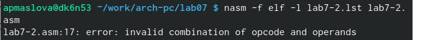

---
## Front matter
title: "Отчёт по лабораторной работе №7"
subtitle: "дисциплина: Архитектура компьютера"
author: "Маслова Анна Павловна"

## Generic otions
lang: ru-RU
toc-title: "Содержание"

## Bibliography
bibliography: bib/cite.bib
csl: pandoc/csl/gost-r-7-0-5-2008-numeric.csl

## Pdf output format
toc: true # Table of contents
toc-depth: 2
lof: true # List of figures
lot: true # List of tables
fontsize: 12pt
linestretch: 1.5
papersize: a4
documentclass: scrreprt
## I18n polyglossia
polyglossia-lang:
  name: russian
  options:
	- spelling=modern
	- babelshorthands=true
polyglossia-otherlangs:
  name: english
## I18n babel
babel-lang: russian
babel-otherlangs: english
## Fonts
mainfont: PT Serif
romanfont: PT Serif
sansfont: PT Sans
monofont: PT Mono
mainfontoptions: Ligatures=TeX
romanfontoptions: Ligatures=TeX
sansfontoptions: Ligatures=TeX,Scale=MatchLowercase
monofontoptions: Scale=MatchLowercase,Scale=0.9
## Biblatex
biblatex: true
biblio-style: "gost-numeric"
biblatexoptions:
  - parentracker=true
  - backend=biber
  - hyperref=auto
  - language=auto
  - autolang=other*
  - citestyle=gost-numeric
## Pandoc-crossref LaTeX customization
figureTitle: "Рис."
tableTitle: "Таблица"
listingTitle: "Листинг"
lofTitle: "Список иллюстраций"
lotTitle: "Список таблиц"
lolTitle: "Листинги"
## Misc options
indent: true
header-includes:
  - \usepackage{indentfirst}
  - \usepackage{float} # keep figures where there are in the text
  - \floatplacement{figure}{H} # keep figures where there are in the text
---

# Цель работы

Изучение команд условного и безусловного переходов. Приобретение навыков написания
программ с использованием переходов. Знакомство с назначением и структурой файла
листинга.

# Выполнение лабораторной работы

Создаём каталог для программ лабораторной работы №7, перейдём в него и создадими файл *lab7-1.asm* (рис. @fig:001).

{#fig:001 width=70%}

 Введём в файл *lab7-1.asm* текст программы с использованием инструкции *jmp* (рис. @fig:002).

{#fig:002 width=70%}

Создадим исполняемый файл и запустим его (рис. @fig:003).

{#fig:003 width=70%}

Мы видим, что "Сообщение №1" на экран не вывелось, но осуществился вывод "Сообщение №2" и "Сообщение №3". Таким образом, использование инструкции `jmp _label2` меняет порядок исполнения инструкций и позволяет выполнить инструкции начиная с метки `_label2`, пропустив вывод первого сообщения.

Изменим программу так, чтобы она выводила сначала ‘Сообщение № 2’, потом ‘Сообщение № 1’ и завершала работу. Для этого в текст программы после вывода сообщения № 2 добавим инструкцию `jmp` с меткой `_label1` (т.е. переход к инструкциям вывода сообщения № 1) и после вывода сообщения № 1 добавим инструкцию `jmp` с меткой `_end` (т.е. переход к инструкции `call quit`) (рис. @fig:004).

{#fig:004 width=70%}

Создадим исполняемый файл и проверим его работу (рис. @fig:005).

{#fig:005 width=70%}

Как мы видим, программа работает корректно: выводится сначала 'Сообщение № 2’, потом ‘Сообщение № 1’, и работа завершилась.

Теперь изменим текст программы (рис. @fig:006)так, чтобы вывод программы был следующим:

```nasm
Сообщение № 3
Сообщение № 2
Сообщение № 1
```

{#fig:006 width=70%}

Создадим исполняемый файл и проверим его работу (рис. @fig:007).

{#fig:007 width=70%}

Как мы видим, программа выводит нужные сообщения в верной последовательности.

Далее создадим файл *lab7-2.asm* в каталоге *~/work/arch-pc/lab07*. В этот файл введём текст программы, которая определяет и выводит на экран наибольшую из 3
целочисленных переменных: A,B и C (рис. @fig:008, рис. @fig:009).

{#fig:008 width=70%}

{#fig:009 width=70%}

Теперь создадим исполняемый файл и проверим его работу (рис. @fig:010).

{#fig:010 width=70%}

Как мы видим, с при разных введённых `В` программа выдаёт корректные результаты.

Теперь изучим структуру файла листинга. Создадим файл листинга для программы из файла *lab7-2.asm* и откроем этот файл с помощью редактора *mcedit* (рис. @fig:011).

{#fig:011 width=70%}

Текст файла листинга представлен следующим образом: (рис. @fig:012).

{#fig:012 width=70%}

Рассмотрим подробно строки 20, 21 и 22.

* В строке 20 содержится только комментарий ` ;Преобразование В из символа в число `. Этой строке присвоен определённый номер, однако в ней не генерируется никакой машинный код. Отсутствуют также поля с адресом и исходным текстом программы. 
* В строке 21 содержится следующий текст программы: ` mov eax,B `. Адрес ` 00000101 ` соответствует смещению машинного кода ` B8[0a000000] ` от начала текущего сегмента
* В строке 22 содержится следующий текст программы: ` call atoi `. Адрес ` 00000106 ` соответствует смещению машинного кода ` E891FFFFFF ` от начала текущего сегмента.

Откроем файл с программой *lab7-2.asm* и в инструкции *mov* удалим один из двух операндов (рис. @fig:013).

{#fig:013 width=70%}

Выполним трансляцию с получением файла листинга (рис. @fig:014).

{#fig:014 width=70%}

Как мы видим, транслятор обнаружил ошибку при ассемблировании и вывел её на экран. 
Посмотрим, что произошло с созданным файлом листинга: (рис. @fig:020)

{#fig:020 width=70%}

Как мы видим, в файле листинга также сказано, что в файле ошибка.

# Выполнение заданий для самостоятельной работы

Теперь напишем программу нахождения наименьшей из 3 целочисленных переменных *a,b8* и *c*.
Значения переменных возьмём в сооответствии с вариантом №15: $a=32, b=6, c=54$. Создадим файл *func1.asm* и введём в него текст программы из листинга 7.1 (рис. @fig:015).

**Листинг 7.1. Программа  нахождения наименьшей из 3 целочисленных переменных a,b и c**

```nasm

%include 'in_out.asm'
section .data
msg db 'Наименьшее число: ',0h
a dd 32
b dd 6
c dd 54
section .bss
min resb 10
section .text
global _start
_start:

 ;Записываем a в переменную min
 mov ecx,[a]
 mov [min],ecx
 ;Сравниваем А и С
 cmp ecx,[c]
 jl check_B  ;Если А<C, то переход на метку 'check_B'
 mov ecx,[c]  ;Иначе 'ecx=C'
 mov [min],ecx
 
 check_B:
 mov ecx,[min]
 cmp ecx,[b]
 jl fin  ;если min(A,C)<B, то переход на fin
 mov ecx,[b]  ;иначе ecx=B
 mov [min],ecx
 ;Вывод результата
 fin:
 mov eax,msg ;Вывод "Наименьшее число"
 call sprint
 mov eax,[min]  ;Вывод min(A,B,C)
 call iprintLF
 call quit
 
```
{#fig:015 width=70%}

 Создадим исполняемый файл и запустим программу (рис. @fig:016).

{#fig:016 width=70%}

 На экран программа вывела наименьшую из трёх переменных, равную 6. Программа работает корректно.

Теперь напишем программу, которая для введенных с клавиатуры значений $x$ и $a$ вычисляет значение заданной функции $f(x)$ и выводит результат вычислений. Вид функции $f(x)$, соответствующий варианту №15, следующий:
 
$$
f(x)=a+10, x<a
$$

$$
f(x)=x+10, x \geq a
$$

Создадим файл *func2.asm* и введём в него текст программы из листинга 7.2 (рис. @fig:017, рис. @fig:018).

**Листинг 7.2. Программа вычисления значения функции**

```nasm

%include 'in_out.asm'
SECTION .data
msg1: DB 'Введите x: ',0
msg2: DB 'Введите a: ',0
msg3: DB 'f(x) = ',0
section .bss
x resb 10
a resb 10
f resb 10
SECTION .text
GLOBAL _start
_start:
;Вывод сообщения и ввод х
mov eax,msg1
call sprint
mov ecx,x
mov edx,10
call sread
;Вывод сообщения и ввод а
mov eax,msg2
call sprint
mov ecx,a
mov edx,10
call sread
;преобразоание х из сивола в число
mov eax,x
call atoi
mov [x],eax
;преобразование а из симвла в число
mov eax,a
call atoi
mov [a],eax
;Сравниваем х и а
mov ecx,[x]
cmp ecx,[a]
jl _label ;если х меньше а
mov eax,[x]  ;иначе
jmp fun

_label:
mov eax,[a]
jmp fun

fun:
add eax,10
mov [f],eax
;Вывод сообщения и результата
mov eax,msg3
call sprint
mov eax,[f]
call iprintLF
call quit

```
{#fig:017 width=70%}

{#fig:018 width=70%}

 Создадим исполняемый файл и проверим его работу для заданных значений: $ x_1 , a_1 = (2;3), x_2 , a_2 = (4;2) $ (рис. @fig:019)

{#fig:019 width=70%}

 После проверки убедились, что программа работает верно.

# Выводы

 Мы познакомились с командами условного и безусловного переходов языка ассемблера NASM и научились писать программы с их использованием. Также изучили назначение и структуру файла листинга.

# Список литературы{.unnumbered}

1. GDB: The GNU Project Debugger. — URL: https://www.gnu.org/software/gdb/.
2. GNU Bash Manual. — 2016. — URL: https://www.gnu.org/software/bash/manual/.
3. Midnight Commander Development Center. — 2021. — URL: https://midnight-commander.
org/.
4. NASM Assembly Language Tutorials. — 2021. — URL: https://asmtutor.com/.
5. Newham C. Learning the bash Shell: Unix Shell Programming. — O’Reilly Media, 2005. —
354 с. — (In a Nutshell). — ISBN 0596009658. — URL: http://www.amazon.com/Learningbash-Shell-Programming-Nutshell/dp/0596009658.
6. Robbins A. Bash Pocket Reference. — O’Reilly Media, 2016. — 156 с. — ISBN 978-1491941591.
7. The NASM documentation. — 2021. — URL: https://www.nasm.us/docs.php.
8. Zarrelli G. Mastering Bash. — Packt Publishing, 2017. — 502 с. — ISBN 9781784396879.
9. Колдаев В. Д., Лупин С. А. Архитектура ЭВМ. — М. : Форум, 2018.
10. Куляс О. Л., Никитин К. А. Курс программирования на ASSEMBLER. — М. : Солон-Пресс,
2017.

