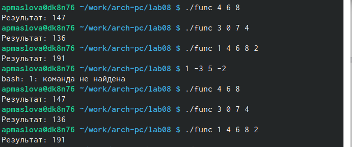

---
## Front matter
title: "Отчёт по лабораторной работе №8"
subtitle: "дисциплина: Архитектура компьютера"
author: "Маслова Анна Павловна"

## Generic otions
lang: ru-RU
toc-title: "Содержание"

## Bibliography
bibliography: bib/cite.bib
csl: pandoc/csl/gost-r-7-0-5-2008-numeric.csl

## Pdf output format
toc: true # Table of contents
toc-depth: 2
lof: true # List of figures
lot: true # List of tables
fontsize: 12pt
linestretch: 1.5
papersize: a4
documentclass: scrreprt
## I18n polyglossia
polyglossia-lang:
  name: russian
  options:
	- spelling=modern
	- babelshorthands=true
polyglossia-otherlangs:
  name: english
## I18n babel
babel-lang: russian
babel-otherlangs: english
## Fonts
mainfont: PT Serif
romanfont: PT Serif
sansfont: PT Sans
monofont: PT Mono
mainfontoptions: Ligatures=TeX
romanfontoptions: Ligatures=TeX
sansfontoptions: Ligatures=TeX,Scale=MatchLowercase
monofontoptions: Scale=MatchLowercase,Scale=0.9
## Biblatex
biblatex: true
biblio-style: "gost-numeric"
biblatexoptions:
  - parentracker=true
  - backend=biber
  - hyperref=auto
  - language=auto
  - autolang=other*
  - citestyle=gost-numeric
## Pandoc-crossref LaTeX customization
figureTitle: "Рис."
tableTitle: "Таблица"
listingTitle: "Листинг"
lofTitle: "Список иллюстраций"
lotTitle: "Список таблиц"
lolTitle: "Листинги"
## Misc options
indent: true
header-includes:
  - \usepackage{indentfirst}
  - \usepackage{float} # keep figures where there are in the text
  - \floatplacement{figure}{H} # keep figures where there are in the text
---

# Цель работы

Приобретение навыков написания программ с использованием циклов и обработкой аргументов командной строки.

# Выполнение лабораторной работы

Для начала создаём каталог для программ лабораторной работы №8, перейдём в него и создадим файл *lab8-1.asm* (рис. @fig:001).

{#fig:001 width=70%}

Введём в файл *lab8-1.asm* текст программы вывода значений регистра *ecx* (рис. @fig:002).

{#fig:002 width=70%}

Создадим исполняемый файл и проверим его работу (рис. @fig:003).

{#fig:003 width=70%}

На экран вывелись значения от *N* до 1.

Данный пример показывает, что использование регистра *ecx* в теле цикла *loop* может привести к некорректной работе программы. Подкорректируем текст программы добавив изменение значения регистра *ecx* в цикле (рис. @fig:004).

{#fig:004 width=70%}

Создадим исполняемый файл и проверим его работу (рис. @fig:005).

{#fig:005 width=70%}

Как мы видим, в этом случае программа работает долго, число проходов гораздо больше заявленного *N*. Регистр *ecx* принимает большие чётные значения, меньшие, но близкие к 5000000000. 

Для использования регистра *ecx* в цикле и сохранения корректности работы программы можно использовать стек. 
Внесём изменения в текст программы добавив команды *push* и *pop* (добавления в стек *push* и извлечения из стека *pop*) для сохранения значения счетчика цикла *loop* (рис. @fig:006).

{#fig:006 width=70%}

Создадим исполняемый файл и проверим его работу (рис. @fig:007).

{#fig:007 width=70%}

В данном случае число проходов цикла соответствует введённому числу *N*. На экран вывелись числа от *N-1* до 0.

Далее познакомимся с другой программой. Создадим файл *lab8-2.asm* в каталоге `~/work/arch-pc/lab08` и введём в него текст программы, которая выводит на экран аргументы командной строки (рис. @fig:008).

{#fig:008 width=70%}

Создаём исполняемый файл и запустим его (рис. @fig:009), указав следующие аргументы:

```nasm
apmaslova@dk1n22:~$ ./lab8-2 аргумент1 аргумент 2 'аргумент 3'
```

{#fig:009 width=70%}

Программа обработала 4 аргумента, т.к. `аргумент 2` был прочитан как `аргумент` и `2`, т.е. разделён на два разных аргумента, которые поочередно были выведены на экран.

Рассмотрим следующую программу. Создадим файл *lab8-3.asm* в каталоге `~/work/arch-pc/lab08` и введём в него текст программы, которая выводит сумму чисел, которые передаются в программу как аргументы (рис. @fig:010).

{#fig:010 width=70%}

Создадим исполняемый файл и запустим его, указав аргументы (рис. @fig:011).

{#fig:011 width=70%}

Программа работает корректно: выводит на экран сумму аргументов командной строки.

А теперь изменим текст этой программы для вычисления произведения аргументов командной строки. Введём в файл *lab8-3.asm* текст из рис. @fig:012 :

{#fig:012 width=70%}

Создадим исполняемый файл и запустим его, указав аргументы (рис. @fig:013). 

{#fig:013 width=70%}

Как мы видим, программа верно вычисляет произведение аргументов командной строки.

# Выполнение заданий для самостоятельной работы

Напишем программу, которая находит сумму значений функции $f(x)$ для $x = x_1 , x_2, ..., x_n$ .
То есть программа должна выводить значения $f(x_1) + f(x_2) + ... + f(x_n)$.

Варианту №15 соответствует следующая функция:

$$
f(x) = 6x + 13
$$

В том же каталоге создадим файл *func.asm* и внесём в него текст программы из листинга 8.4 (рис. @fig:014).

**Листинг 8.4. Программа, вычисления суммы значений функции**

```nasm

%include 'in_out.asm'

section .data
msg db "Результат: ",0

section .text
global _start
_start:

pop ecx
pop edx
sub ecx,1
mov esi,0 ;используем esi для хранения промежуточных сумм f(x)

;6x+13
next:
cmp ecx,0h ;проверяем, есть ли ещё аргументы
jz _end ;если их нет, выходим из цикла
pop eax
call atoi ;преобразуем символ в число
mov ebx,6
mul ebx ;умножаем след.аргумент на 6 'eax=eax*6'
add eax,13 ;eax=eax+13
add esi,eax ;помещаем значение f(x) из eax в esi
loop next

_end:
mov eax,msg
call sprint
mov eax,esi
call iprintLF ;печать результата (суммы)

call quit

```

{#fig:014 width=70%}

Создадим исполняемый файл и несколько раз запустим его, указав аргументы (рис. @fig:015).

{#fig:015 width=70%}

Как мы видим, программа работает корректно и верно считает сумму значений функции. 

# Выводы

Мы научились писать программы использованием циклов и обработкой аргументов командной строки.

# Список литературы{.unnumbered}

1. GDB: The GNU Project Debugger. — URL: https://www.gnu.org/software/gdb/.
2. GNU Bash Manual. — 2016. — URL: https://www.gnu.org/software/bash/manual/.
3. Midnight Commander Development Center. — 2021. — URL: https://midnight-commander.
org/.
4. NASM Assembly Language Tutorials. — 2021. — URL: https://asmtutor.com/.
5. Newham C. Learning the bash Shell: Unix Shell Programming. — O’Reilly Media, 2005. —
354 с. — (In a Nutshell). — ISBN 0596009658. — URL: http://www.amazon.com/Learning-
bash-Shell-Programming-Nutshell/dp/0596009658.
6. Robbins A. Bash Pocket Reference. — O’Reilly Media, 2016. — 156 с. — ISBN 978-1491941591.
7. The NASM documentation. — 2021. — URL: https://www.nasm.us/docs.php.
8. Zarrelli G. Mastering Bash. — Packt Publishing, 2017. — 502 с. — ISBN 9781784396879.
9. Колдаев В. Д., Лупин С. А. Архитектура ЭВМ. — М. : Форум, 2018.
10. Куляс О. Л., Никитин К. А. Курс программирования на ASSEMBLER. — М. : Солон-Пресс,
2017.

