---
## Front matter
title: "Отчёт по лабораторной работе №9"
subtitle: "дисциплина: Архитектура компьютера"
author: "Маслова Анна Павловна"

## Generic otions
lang: ru-RU
toc-title: "Содержание"

## Bibliography
bibliography: bib/cite.bib
csl: pandoc/csl/gost-r-7-0-5-2008-numeric.csl

## Pdf output format
toc: true # Table of contents
toc-depth: 2
lof: true # List of figures
lot: true # List of tables
fontsize: 12pt
linestretch: 1.5
papersize: a4
documentclass: scrreprt
## I18n polyglossia
polyglossia-lang:
  name: russian
  options:
	- spelling=modern
	- babelshorthands=true
polyglossia-otherlangs:
  name: english
## I18n babel
babel-lang: russian
babel-otherlangs: english
## Fonts
mainfont: PT Serif
romanfont: PT Serif
sansfont: PT Sans
monofont: PT Mono
mainfontoptions: Ligatures=TeX
romanfontoptions: Ligatures=TeX
sansfontoptions: Ligatures=TeX,Scale=MatchLowercase
monofontoptions: Scale=MatchLowercase,Scale=0.9
## Biblatex
biblatex: true
biblio-style: "gost-numeric"
biblatexoptions:
  - parentracker=true
  - backend=biber
  - hyperref=auto
  - language=auto
  - autolang=other*
  - citestyle=gost-numeric
## Pandoc-crossref LaTeX customization
figureTitle: "Рис."
tableTitle: "Таблица"
listingTitle: "Листинг"
lofTitle: "Список иллюстраций"
lotTitle: "Список таблиц"
lolTitle: "Листинги"
## Misc options
indent: true
header-includes:
  - \usepackage{indentfirst}
  - \usepackage{float} # keep figures where there are in the text
  - \floatplacement{figure}{H} # keep figures where there are in the text
---

# Цель работы

Приобретение навыков написания программ с использованием подпрограмм. Знакомство с методами отладки при помощи GDB и его основными возможностями.

# Выполнение лабораторной работы

Создадим каталог для выполнения лабораторной работы №9, перейдём в него и создадим файл `lab09-1.asm`. (рис. @fig:001)

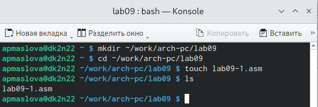{#fig:001 width=70%}

Рассмотрим программу вычисления арифметического выражения $f(x) = 2𝑥 + 7$ . Введём в файл lab09-1.asm текст этой программы. (рис. @fig:001)

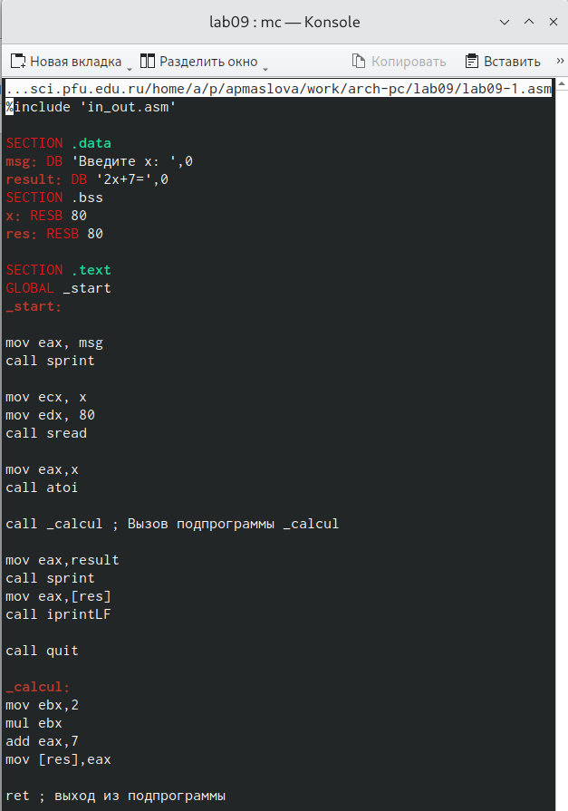{#fig:002 width=70%}

Создадим исполняемый файл и проверим его работу. (рис. @fig:003)

{#fig:003 width=70%}

Изменим текст программы, добавив подпрограмму `_subcalcul` в подпрограмму `_calcul`, для вычисления выражения `f(g(x))`, где `x` вводится с клавиатуры, `f(x) = 2x + 7`, `g(x) = 3x − 1`. Результат возвращается в основную программу для вывода результата на экран. (рис. @fig:004 , рис. @fig:005)

{#fig:004 width=70%}

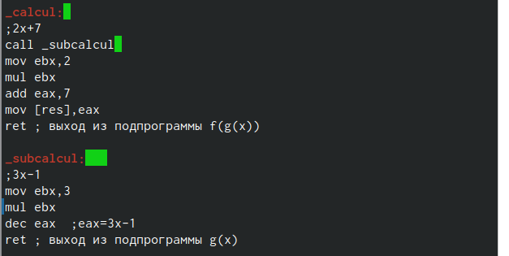{#fig:005 width=70%}

Создадим исполняемый файл и проверим его работу. (рис. @fig:006)

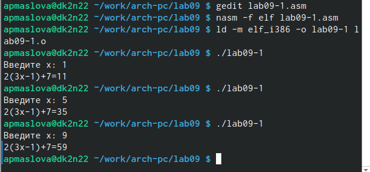{#fig:006 width=70%}

Создадим файл `lab09-2.asm` с текстом программы печати сообщения *Hello world!* (рис. @fig:007)

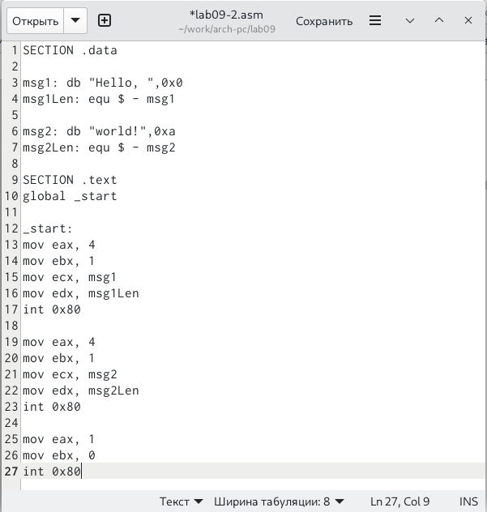{#fig:007 width=70%}

Получим исполняемый файл. Для работы с GDB в исполняемый файл необходимо добавить отладочную информацию, для этого трансляцию программ необходимо проводить с ключом `-g`. (рис. @fig:008)

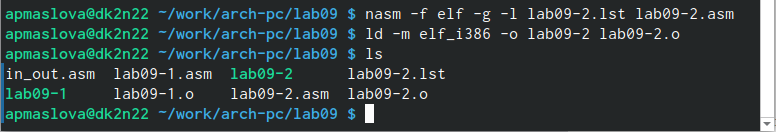{#fig:008 width=70%}

Загрузим исполняемый файл в отладчик `gdb`. (рис. @fig:009)

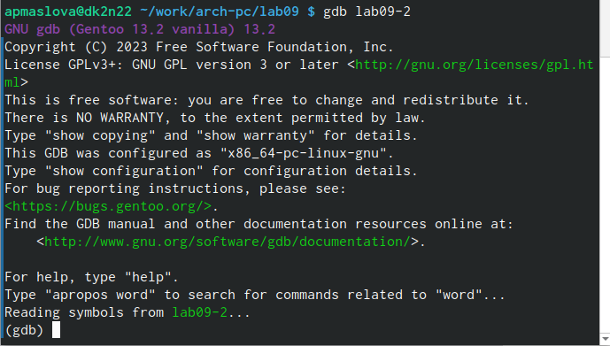{#fig:009 width=70%}

Проверим работу программы, запустив ее в оболочке GDB с помощью команды `run` (рис. @fig:010).

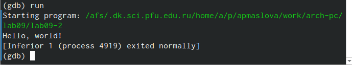{#fig:010 width=70%}

Для более подробного анализа программы установим брейкпоинт на метку `_start`, с которой начинается выполнение любой ассемблерной программы, и запустим её. (рис. @fig:011)

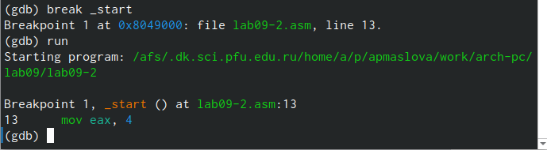{#fig:011 width=70%}

Посмотрим дисассимилированный код программы с помощью команды `disassemble` начиная с метки `_start`. (рис. @fig:012)

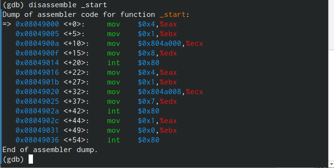{#fig:012 width=70%}

Переключимся на отображение команд с Intel’овским синтаксисом (рис. @fig:013)

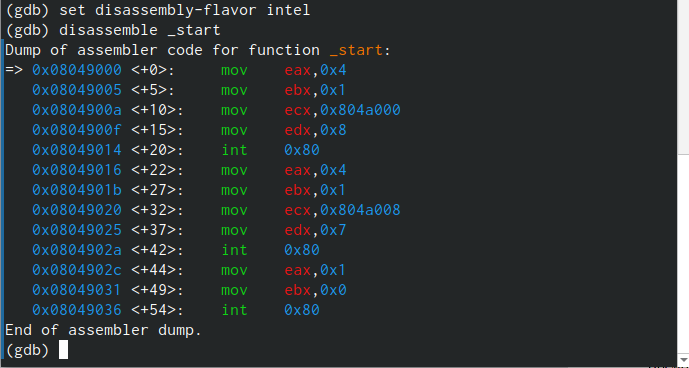{#fig:013 width=70%}

Как мы видим, в синтаксисе `Intel` после команды выводится регистр, куда помещается значение, а затем адрес помещемого значения или число. А в синтаксисе `ATT`сначала выводится ссылка на заносимое в регистр значение (для этого перед значением есть символ `$`), а уже после неё регистр с символом `%`.

Включим режим псевдографики для более удобного анализа программы (рис. @fig:014)

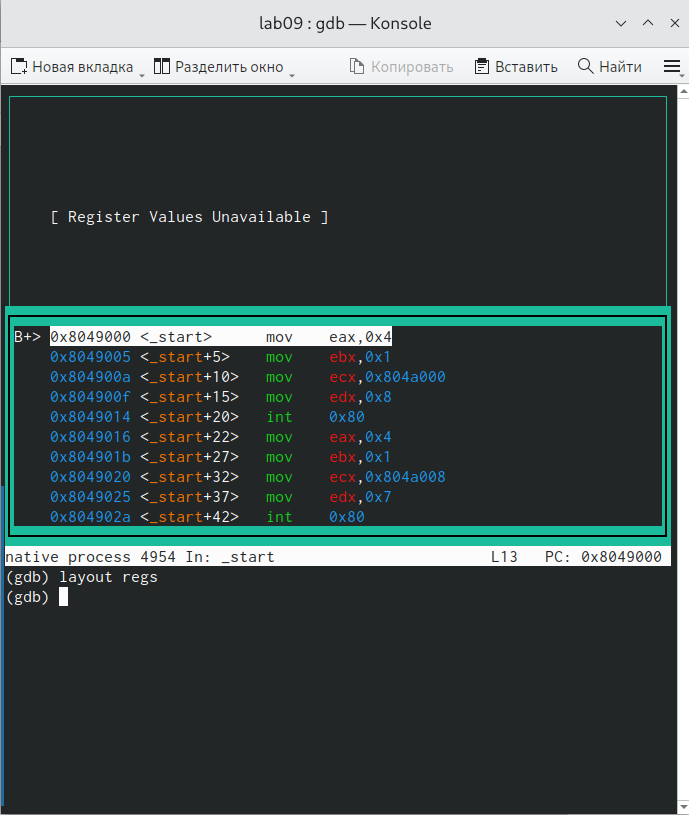{#fig:014 width=70%}

На предыдущих шагах была установлена точка останова по имени метки `_start`. Проверим это с помощью команды `info breakpoints` (рис. @fig:015)

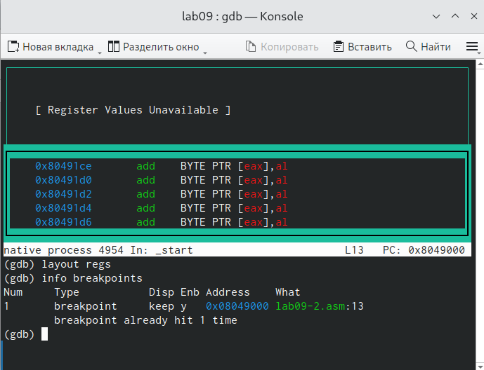{#fig:015 width=70%}

Установим еще одну точку останова по адресу инструкции `mov ebx,0x0`. Адрес инструкции можно увидеть в средней части экрана в левом столбце соответствующей инструкции. В нашем случае адрес следующий: `0x8049031`. После этого посмотрим информацию о всех точках останова (рис. @fig:016).

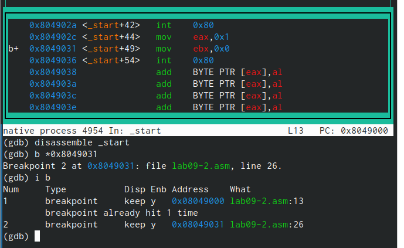{#fig:016 width=70%}

Выполним 5 инструкций с помощью команды `stepi` (или `si`) и проследим за изменением значений регистров (рис. @fig:017 - @fig:021). 

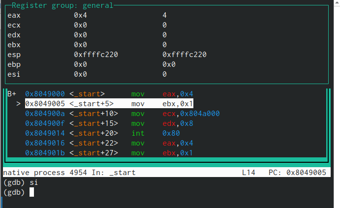{#fig:017 width=70%}

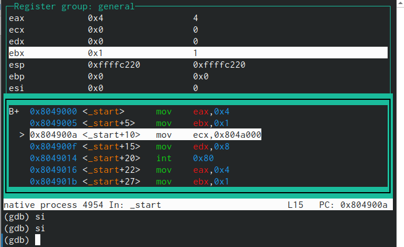{#fig:018 width=70%}

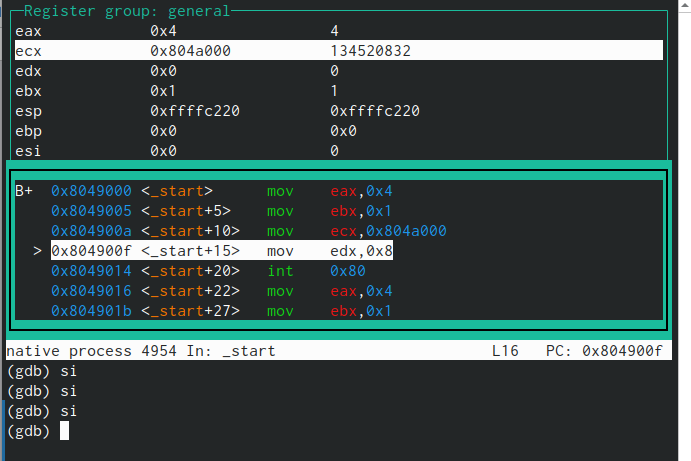{#fig:019 width=70%}

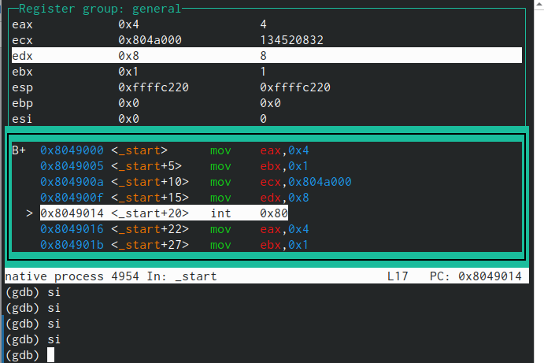{#fig:020 width=70%}

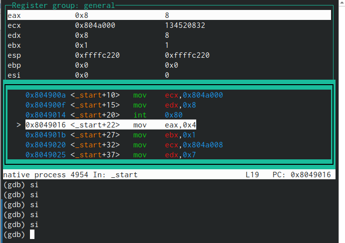{#fig:021 width=70%}

Как мы видим на верхней панели, изменились значения регистров `eax`, `ecx`, `edx` и `ebx`. Остальные регистры остаются без изменений.

Теперь посмотрим значение переменной `msg1` по имени (рис. @fig:022).

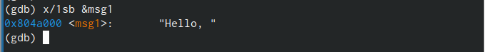{#fig:022 width=70%}

Вывелась строка "Hello, ". 

Теперь посмотрим значение переменной `msg2` по адресу. Адрес переменной определим по дизассемблированной инструкции. Посмотрим инструкцию `mov ecx,msg2` которая записывает в регистр `ecx` адрес перемененной `msg2`(рис. @fig:023).

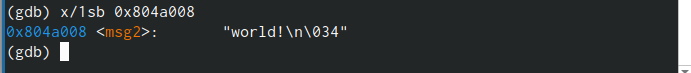{#fig:023 width=70%}

Изменим первый символ переменной `msg1` и первый символ переменной `msg2`(рис. @fig:024).

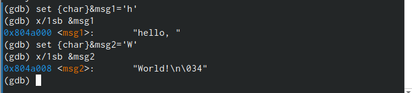{#fig:024 width=70%}

Выведем в различных форматах (в шестнадцатеричном формате, в двоичном формате и в символьном виде) значение регистра `edx`(рис. @fig:025).

{#fig:025 width=70%}

Теперь с помощью команды `set` изменим значение регистра `ebx` (рис. @fig:026).

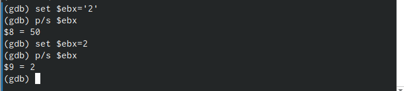{#fig:026 width=70%}

В первом случае мы занесли в регистр `ebx` символ '2', поэтому после запроса `p/s` на вывод значения регистра на экране мы увидели код символа "2", а именно - 50.
А в случае, когда в регистр изначально было занесено число 2, а не символ, команда `p/s $ebx` вывела значение 2.

Завершим выполнение программы с помощью команды `continue` (сокращенно `c`) (рис. @fig:027).

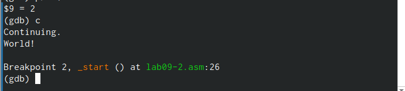{#fig:027 width=70%}

И после этого с помощью команды `quit` вышли из отладчика `gdb`.

Скопируем файл `lab8-2.asm`, созданный при выполнении лабораторной работы №8, с программой, выводящей на экран аргументы командной строки, в файл с именем `lab09-3.asm` и создадим исполняемый файл с ключом `-g` и с файлом листинга (рис. @fig:028).

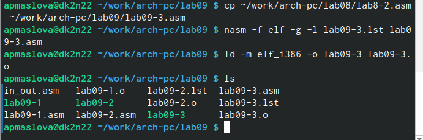{#fig:028 width=70%}

Для загрузки в `gdb` программы с аргументами необходимо использовать ключ `--args`. Загрузим исполняемый файл в отладчик, указав аргументы (рис. @fig:029).

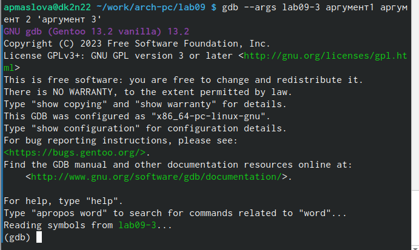{#fig:029 width=70%}

Для начала установим точку останова перед первой инструкцией в программе и запустим её (рис. @fig:030).

{#fig:030 width=70%}

Адрес вершины стека храниться в регистре `esp` и по этому адресу располагается число, равное количеству аргументов командной строки (включая имя программы) (рис. @fig:031).

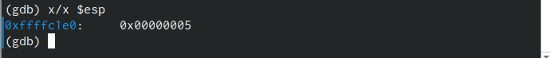{#fig:031 width=70%}

Как видно, число аргументов равно 5 – это имя программы `lab09-3` и непосредственно аргументы: `аргумент1`, `аргумент`, `2` и `аргумент 3`.

Посмотрим остальные позиции стека (рис. @fig:032).

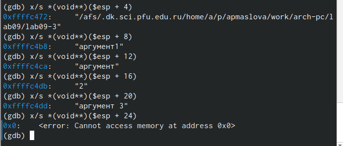{#fig:032 width=70%}

По адесу `[esp+4]` располагается адрес в памяти, где находиться имя программы, по адесу `[esp+8]` храниться адрес первого аргумента, по аресу `[esp+12]` – второго и т.д. Как мы видим, шаг изменения равен 4. Шаг имеет такое значение, потому что при добавлении значения каждого аргумента в стек значение регистра `esp` увеличивается на 4. 

# Выполнение заданий для самостоятельной работы

**Задание №1**

Преобразуем программу из лабораторной работы №8 (Задание №1 для самостоятельной работы), реализовав вычисление значения функции $f(x)$ как подпрограмму.

В лабораторной работе №8 мы реализовывали вычисление в цикле следующей функции:

$$
f(x) = 6x + 13
$$

Теперь для вычисления значения этой функции в цикле мы будем вызывать вспомогательную подпрограмму. Создадим файл `func1.asm` и впишем в него текст программы из листинга 9.4 (рис. @fig:033).

**Листинг 9.4. Программа вычисления суммы значений функции с помощью подпрограммы**

```nasm
%include 'in_out.asm'

section .data
msg db "Результат: ",0

section .text
global _start
_start:

pop ecx
pop edx
sub ecx,1
mov esi,0 ;используем esi для хранения промежуточных сумм f(x)

;6x+13
next:
cmp ecx,0h ;проверяем, есть ли ещё аргументы
jz _end ;если их нет, выходим из цикла
pop eax
call _calcul ;вызов подпрограммы вычисления функции
add esi,eax ;помещаем значение f(x) из eax в esi
loop next

_end:
mov eax,msg
call sprint
mov eax,esi
call iprintLF ;печать результата (суммы)
call quit

_calcul:
call atoi ;преобразуем символ в число
mov ebx,6
mul ebx;   умножаем след.аргумент на 6 'eax=eax*6'
add eax,13  ;eax=eax+13
ret  ;выход из подпрограммы вычисления f(x) 
```

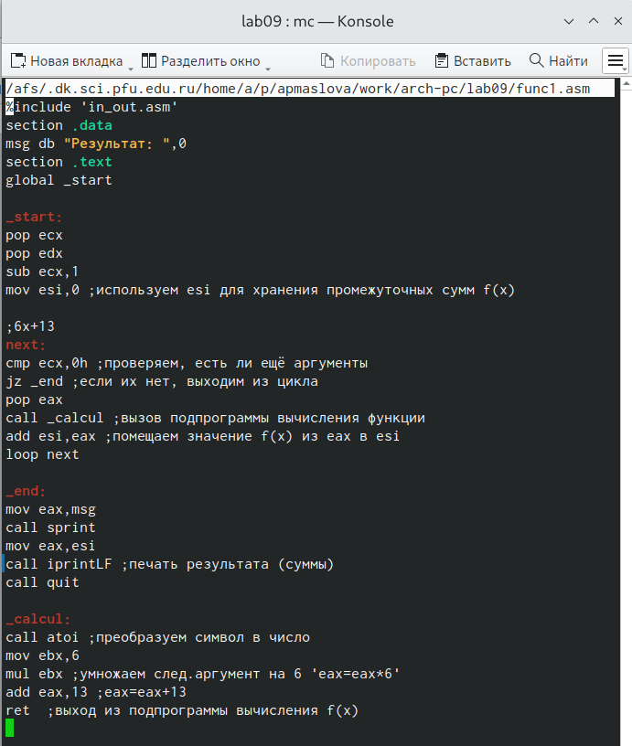{#fig:033 width=70%}

Создадим исполняемый файл и проверим его работу с теми же аргументами (рис. @fig:034).

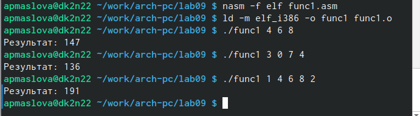{#fig:034 width=70%}

Программа работает корректно: выдаются верные значения сумм. Приступим к выполнению следующего задания. 

**Задание №2**

Создадим файл `func2.asm` и впишем в него текст программы вычисления выражения $(3 + 2) ∗ 4 + 5$ (рис. @fig:035).

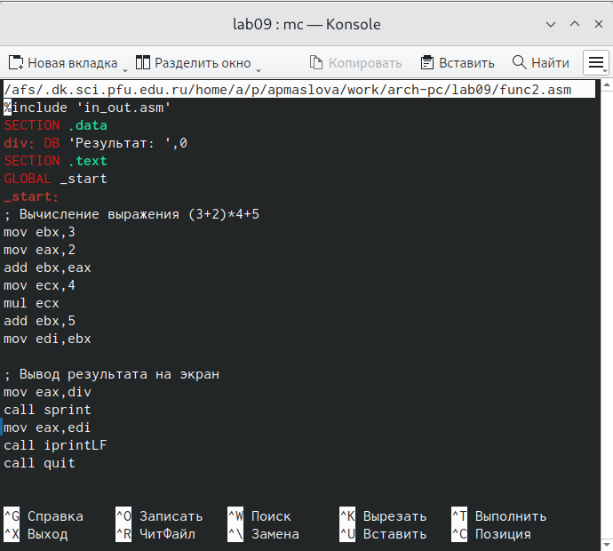{#fig:035 width=70%}

Создадим исполняемый файл и запустим его (рис. @fig:036).

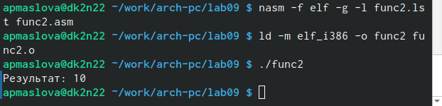{#fig:036 width=70%}

Мы проверили, и действительно, при запуске программа даёт неверный результат.

С помощью отладчика `GDB` проанализируем изменения значений регистров, определим ошибку и исправим её.

Для начала загрузим исполняемый файл в отладчик (рис. @fig:037).

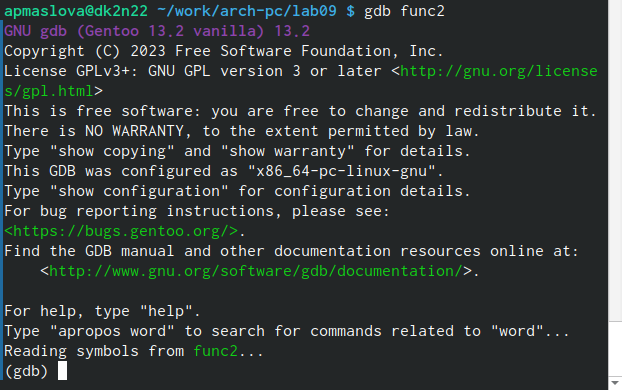{#fig:037 width=70%}

Посмотрим дисассимилированный код программы с помощью команды `disassemble`, начиная с метки `_start` (рис. @fig:038).

{#fig:038 width=70%}

Включим режим псевдографики (рис. @fig:039).

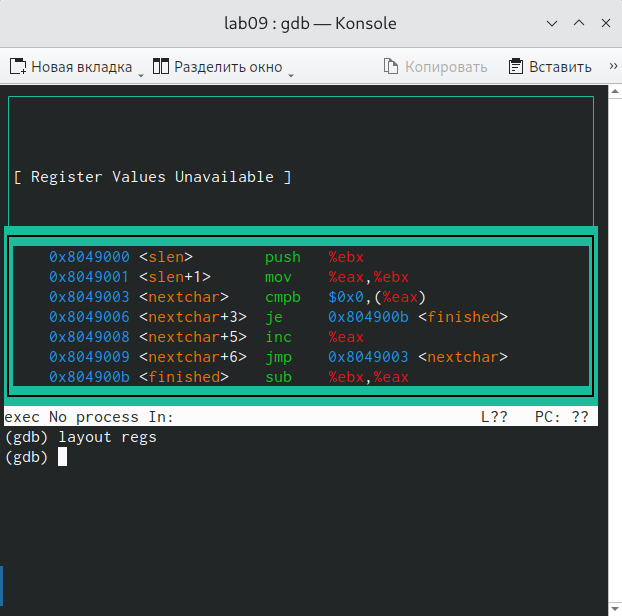{#fig:039 width=70%}

Используем команду для просмотра значений регистров (рис. @fig:040).

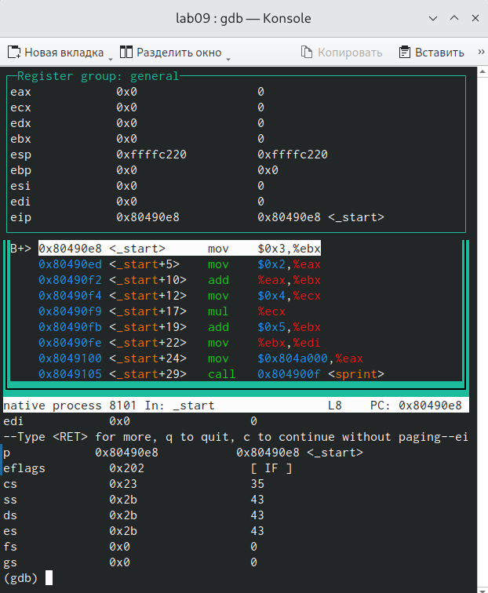{#fig:040 width=70%}

С помощью команды `break` установим точку останова по адресу на инструкции `add ebx,eax` (рис. @fig:041).

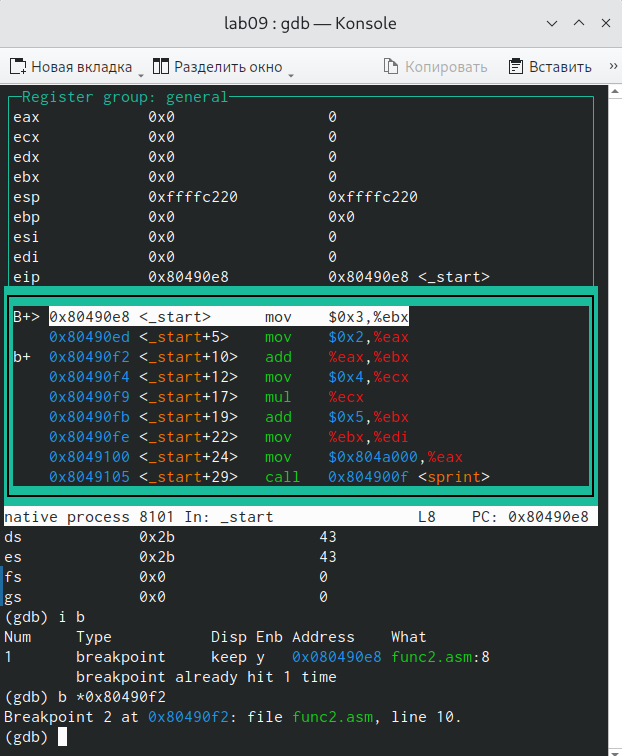{#fig:041 width=70%}

Посмотрим значения регистров на этом этапе с помощью команды `i r` (рис. @fig:042).

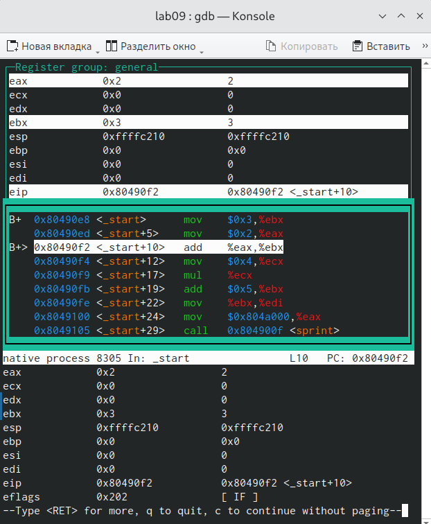{#fig:042 width=70%}

Далее с помощью команды `si` перейдём к следующей инструкции и проследим за изменением значений регистров (рис. @fig:043).

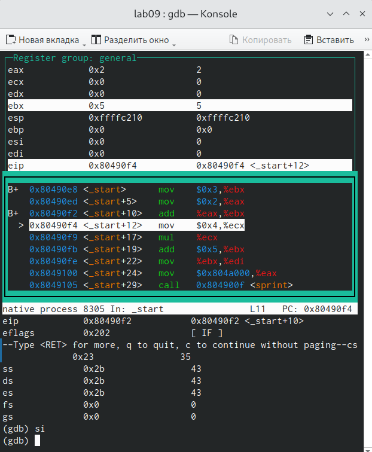{#fig:043 width=70%}

Как мы видим, результат суммы чисел $2$ и $3$ записался в регистр `ebx`. Это могло послужить проблемой для дальнейшего вычисления произведения. Исправим это, изменив значение регистра `eax` и занеся в него значение $5$ с помощью команды `set` (рис. @fig:044).

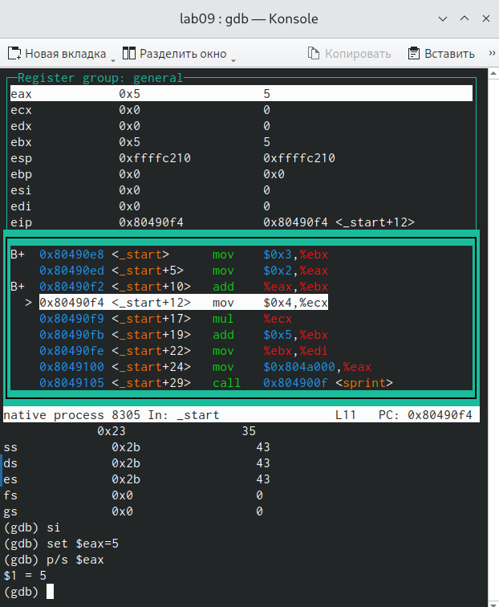{#fig:044 width=70%}

Переходим к следующей инструкции (рис. @fig:045).

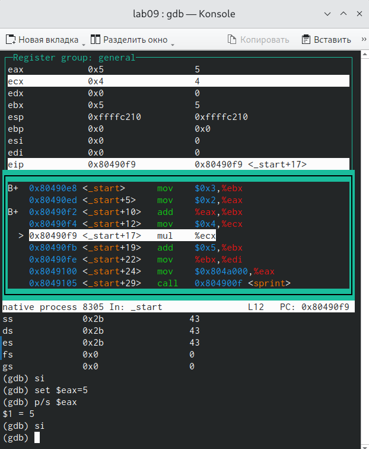{#fig:045 width=70%}

В результате этого шага мы поместили в регистр `ecx` значение $4$ для вычисления произведения. После произведения значения регистров будут следующими: (рис. @fig:046).

{#fig:046 width=70%}

В результате в регистр `eax` было помещено значение произведения $20$. 

Далее к этому значению нужно прибавить $5$. В программе за результат отвечает регистр `ebx`. Поместим в него значение $20 + 5 = 25$ и запустим программу на вывод конечного результата(рис. @fig:047).

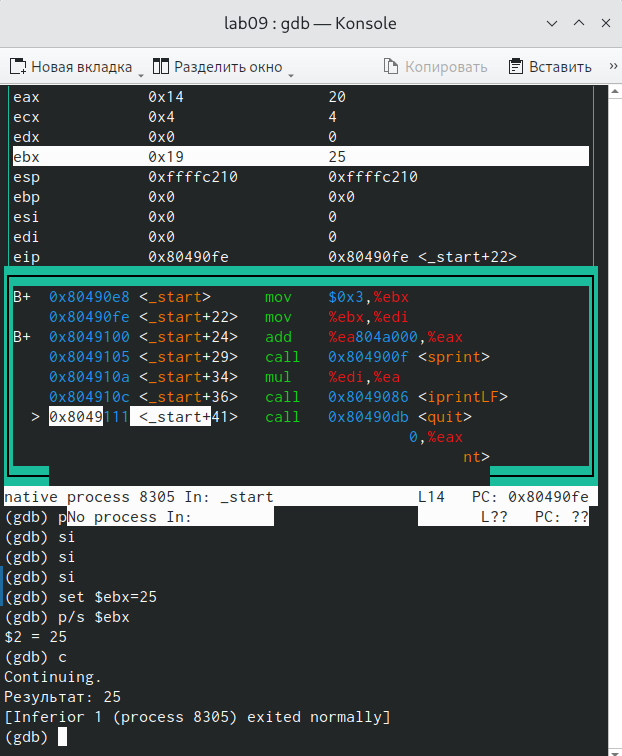{#fig:047 width=70%}

Как мы видим, с учётом всех изменений программа выдаёт верный результат. Теперь изменим код программы в файле `func2.asm` (рис. @fig:048).

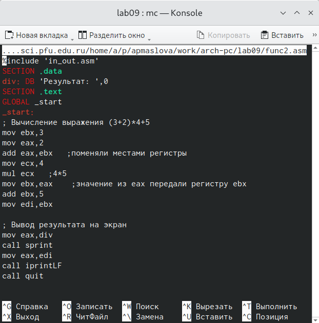{#fig:048 width=70%}

Теперь создадим исполняемый файл и проверим корректность работы программы (рис. @fig:049).

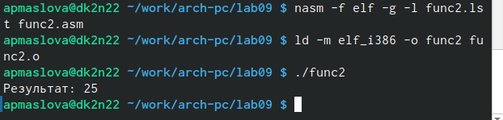{#fig:049 width=70%}

Теперь программа выдаёт верный результат.

# Выводы

Мы научились писать программы с использованием подпрограмм. Познакомились с методами отладки при помощи GDB и его основными возможностями.

# Список литературы{.unnumbered}

1. GDB: The GNU Project Debugger. — URL: https://www.gnu.org/software/gdb/.
2. GNU Bash Manual. — 2016. — URL: https://www.gnu.org/software/bash/manual/.
3. Midnight Commander Development Center. — 2021. — URL: https://midnight-commander.
org/.
4. NASM Assembly Language Tutorials. — 2021. — URL: https://asmtutor.com/.
5. Newham C. Learning the bash Shell: Unix Shell Programming. — O’Reilly Media, 2005. —
354 с. — (In a Nutshell). — ISBN 0596009658. — URL: http://www.amazon.com/Learningbash-Shell-Programming-Nutshell/dp/0596009658.
6. Robbins A. Bash Pocket Reference. — O’Reilly Media, 2016. — 156 с. — ISBN 978-1491941591.
7. The NASM documentation. — 2021. — URL: https://www.nasm.us/docs.php.
8. Zarrelli G. Mastering Bash. — Packt Publishing, 2017. — 502 с. — ISBN 9781784396879.
9. Колдаев В. Д., Лупин С. А. Архитектура ЭВМ. — М. : Форум, 2018.
10. Куляс О. Л., Никитин К. А. Курс программирования на ASSEMBLER. — М. : Солон-Пресс,
2017.

